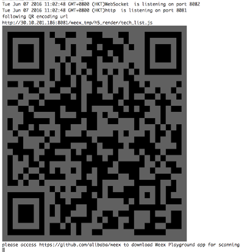
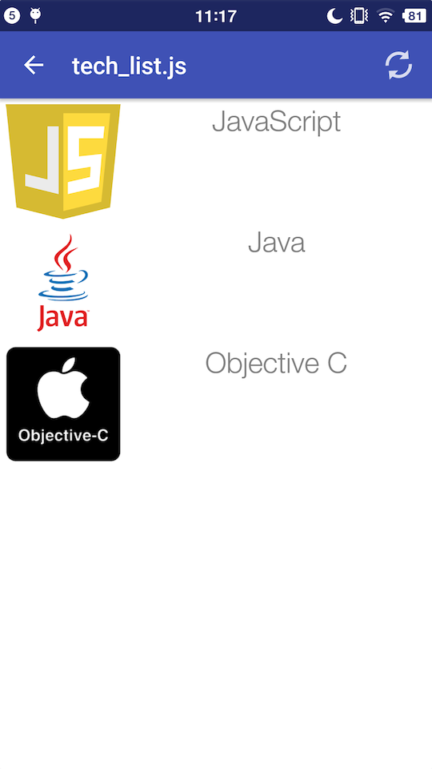
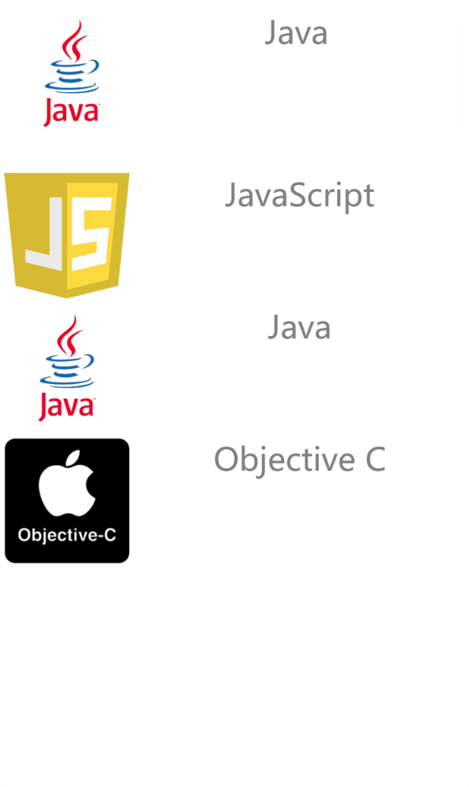

# 快速入门

<span class="weex-version">0.4</span>
<!-- <a href="https://github.com/weexteam/article/issues/4"  class="weex-translate">cn</a> -->

我们将使用Weex编写一个简单的列表，类似的列表经常能在电商类移动应用中见到。

## 开始

我们先编写一个列表项。 它包括一个 `image` 元素 和一个 `text` 元素。

```html
<template>
  <div class="container">
    <div class="cell">
        <image class="thumb" src="http://t.cn/RGE3AJt"></image>
        <text class="title">JavaScript</text>
    </div>
  </div>
</template>

<style>
  .cell { margin-top: 10; margin-left: 10; flex-direction: row; }
  .thumb { width: 200; height: 200; }
  .title { text-align: center; flex: 1; color: grey; font-size: 50; }
</style>
```

请创建一个名为 tech_list.we 的文件( .we 是Weex推荐的后缀名 ) ，请复制粘贴以上代码于其中。

## 预览

因为Weex工具链使用Node.js构建，在进行后续步骤前，你需要先安装 [Node](https://nodejs.org/en/download/) , 在Node.js安装成功后,你可以执行下面的命令来安装Weex命令行程序 [Weex Toolkit](https://www.npmjs.com/package/weex-toolkit) 。

```
npm install -g weex-toolkit
```

在安装结束后，你能通过在命令行窗口执行 weex 命令来检查工具是否安装正确。仅仅输入weex并敲击回车后，你应该看到如下内容显示：

```
Usage: weex foo/bar/your_next_best_weex_script_file.we  [options]

Options:
  --qr     display QR code for native runtime,
  -o,--output  transform weex we file to JS Bundle, output path (single JS bundle file or dir)
  -s,--server  start a http file server, weex .we file will be transforme to JS bundle on the server , specify local root path using the option  
  ......
  --help  Show help         
  -h, --host [default: "127.0.0.1"]
```

如果一切正常， 请在命令行中切换工作目录到刚才存储 tech_list.we 所用目录并输入如下命令：

```
weex tech_list.we
```

你系统默认浏览器的窗口将自动打开以显示如下内容。

(请使用 weex --version 命令检查你的weex-toolkit版本是否大于 0.1.0）


## 语法概念

现在我们来了解下一些简单的语法概念。如`tech_list.we`, 所示，Weex代码由三部分构成： -- *template*（模板）, *style*（样式），和 *script*（脚本）, 这三个概念之于Weex就如 html，css，javascript 之于Web。

模板部分赋予Weex以骨架，由标签以及标签包围的内容构成。Weex中的标签分为开放标签(eg: )和闭合标签(eg: )两种，我们把每一对开放&闭合标签称为一组Weex标签。标签中能添加 *属性*, 不同的属性有不同的含义, 例如, `class` 让同样的样式可以作用于多组Weex标签， `onclick` 属性让标签能对用户点击事件作出回应。

样式部分描述Weex标签如何显示。和你一样，我们喜欢CSS，所以Weex中的样式尽量和CSS标准一致。Weex支持很多CSS中的特性： margin, padding, fixed...... 更好的是， flexbox布局模型在Weex中有着很好的支持。

脚本部分为Weex标签添加数据与逻辑，在这里你能方便的访问本地和远程的数据并更新标签。你还能定义方法并让这些方法响应不同的事件。Weex脚本的组织方式基本遵循于CommonJS module规范。

关于Weex语法的更多信息，你能在 [语法章节](syntax/main.md)查看.

## 添加更多的列表项

单独一个列表项称不上”列表” ， 所以让我们来添加更多的列表项。打开刚才的 `tech_list.we` 文件，更新其中的内容如下：

```html
<template>
  <div class="container">
    <div class="cell">
        <image class="thumb" src="http://t.cn/RGE3AJt"></image>
        <text class="title">JavaScript</text>
    </div>
    <div class="cell">
        <image class="thumb" src="http://t.cn/RGE3uo9"></image>
        <text class="title">Java</text>
    </div>
    <div class="cell">
        <image class="thumb" src="http://t.cn/RGE31hq"></image>
        <text class="title">Objective C</text>
    </div>
  </div>
</template>

<style>
  .cell{ margin-top:10 ; margin-left:10 ; flex-direction: row; }
  .thumb { width: 200; height: 200; }
  .title { text-align: center ; flex: 1; color: grey; font-size: 50; }
</style>
```

现在，让我们来尝试使用Weex Native渲染器来渲染这个文件。打开终端，切换到保存该文件的目录，执行：

```
weex tech_list.we --qr
```

***建议*** 使用 `-h` 参数来指定ip地址和主机名。

```
weex tech_list.we --qr -h {ip or hostname}
```

一个二维码图片就会在终端窗口显示如下；



这个二维码需要配合 [Weex Playground App](http://alibaba.github.io/weex/download.html)工作。下载安装后点击App中的扫码图标，然后用你的手机摄像头扫描终端中的二维码。一个漂亮的列表将出现在你的手机中。



这里我需要强调，这个列表是完全由native view(不是Webkit)来进行渲染的，相比Webkit渲染的界面，你的App能获得更快的页面加载速度和更少的内存开销。

现在你能尝试变更一些 tech_list.we中的内容，在保存变更内容之后， Weex Playground 将会立即在界面上反映出这些变化，这个特性常被称为 **热更新** ，希望能帮助你更方便的进行Weex开发。

## 添加内置组件

除了自己动手从最基础的标签开始编写，Weex还提供很多内置组件。Slider(滑动器)在移动App和页面中很常见，所以我们提供了一个内置的Slider组件让你能在自己的界面里轻松的添加一个滑动器。打开`tech_list.we`，把里面的内容变更如下：

```html
<template>
  <div style="flex-direction: column;">
    <slider class="slider" interval="{{intervalValue}}" auto-play="{{isAutoPlay}}" >
      <div class="slider-pages" repeat="{{itemList}}" onclick="goWeexSite" >
        <image class="thumb" src="{{pictureUrl}}"></image>
        <text class="title">{{title}}</text>
      </div>
    </slider>

  <div class="container" onclick="goWeexSite" >
    <div class="cell">
        <image class="thumb" src="http://t.cn/RGE3AJt"></image>
        <text class="title">JavaScript</text>
    </div>
    <div class="cell">
        <image class="thumb" src="http://t.cn/RGE3uo9"></image>
        <text class="title">Java</text>
    </div>
    <div class="cell">
        <image class="thumb" src="http://t.cn/RGE31hq"></image>
        <text class="title">Objective C</text>
    </div>
  </div>
</template>

<style>
  .cell { margin-top:10 ; margin-left:10 ; flex-direction: row; }
  .thumb { width: 200; height: 200; }
  .title { text-align: center ; flex: 1; color: grey; font-size: 50; }
  .slider {
    margin: 18;
    width: 714;
    height: 230;
  }
  .slider-pages {
    flex-direction: row;
    width: 714;
    height: 200;
  }
</style>

<script>
module.exports = {
    data: {
      intervalValue:"1000",
      isShowIndicators:"true",
      isAutoPlay:"true",
      itemList: [
        {title: 'Java', pictureUrl: 'http://t.cn/RGE3uo9'},
        {title: 'Objective C', pictureUrl: 'http://t.cn/RGE31hq'},
        {title: 'JavaScript', pictureUrl: 'http://t.cn/RGE3AJt'}
      ]
    },
    methods: {
      goWeexSite: function () {
        this.$openURL('http://alibaba.github.io/weex/')
      }
    }
}
</script>
```

在终端中同一目录再次运行这个命令：

```
weex tech_list.we
```

一个漂亮的滑动器将会添加到我们之前编写列表的顶部。



更多有关滑动器组件的信息请在 [这里](components/slider.md)查看。

就像我们之前演示过的，这个界面也能用"Native View"的方式在 Weex Playground App中被渲染。如果你想让你自己的App也获得这样的能力，请访问[安](advanced/integrate-to-android.md)学习如何把Weex集成进入你自己的App中。
