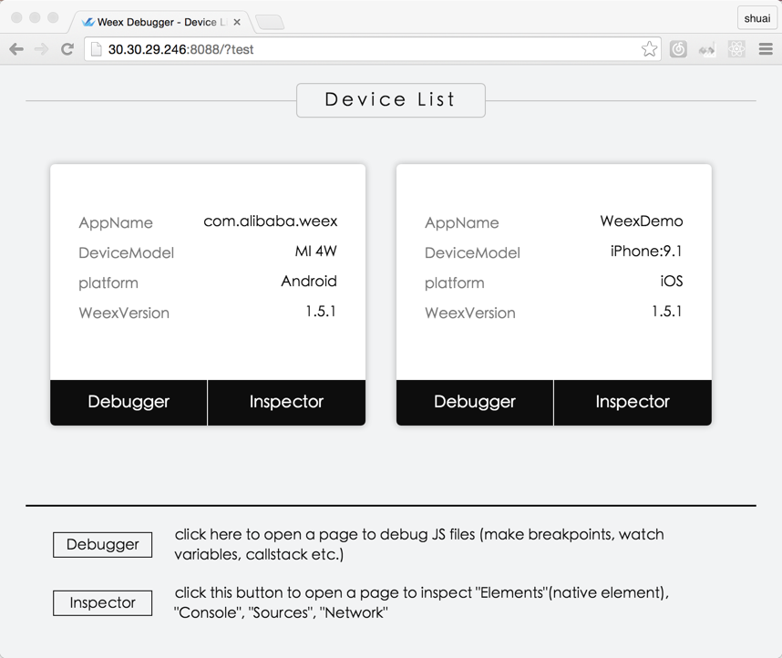
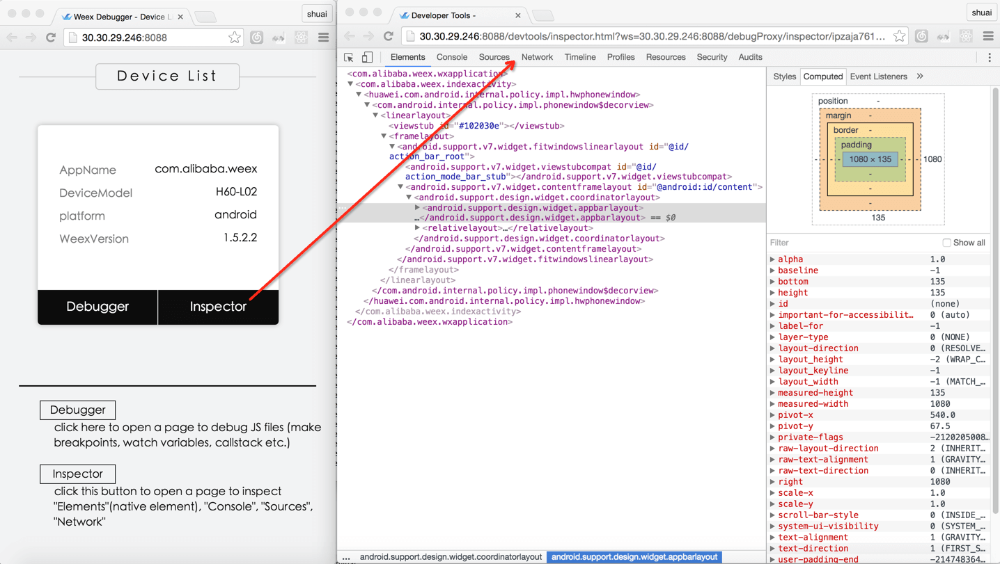
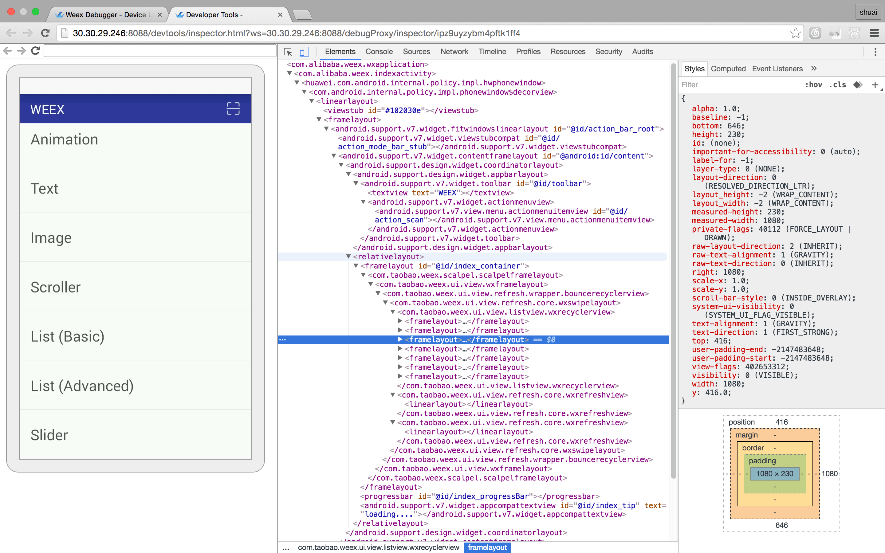
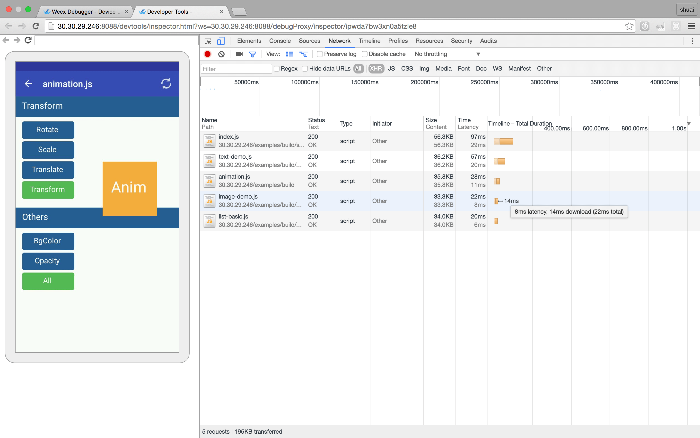
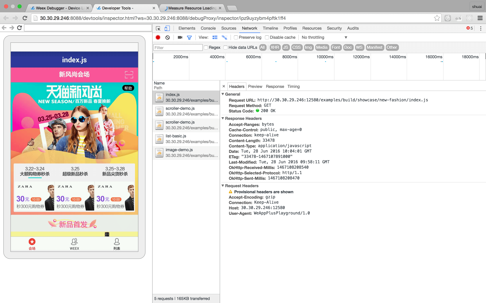
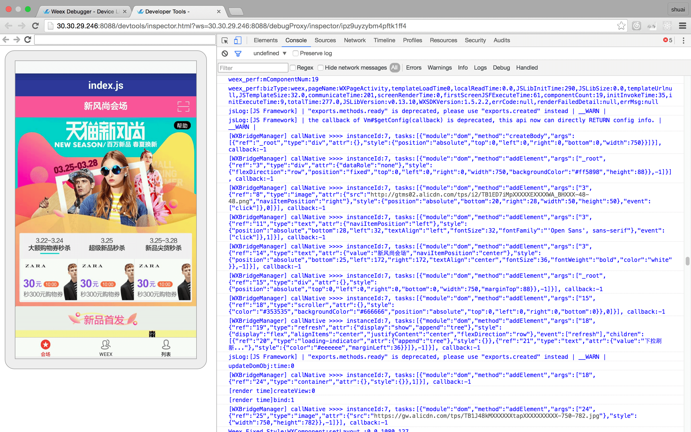
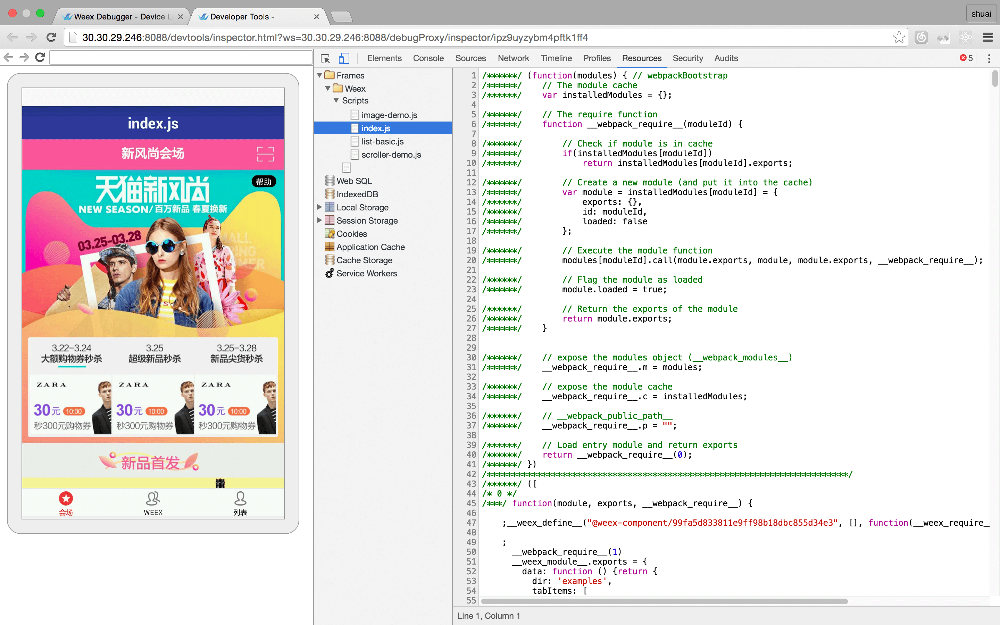
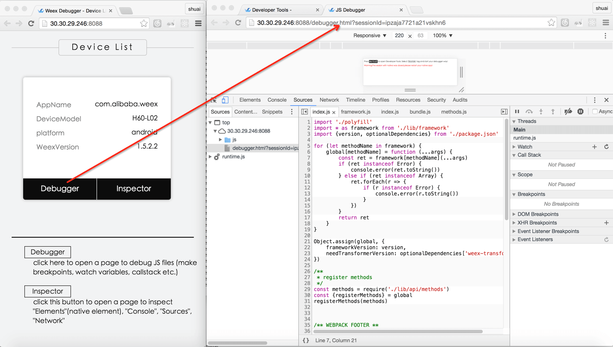
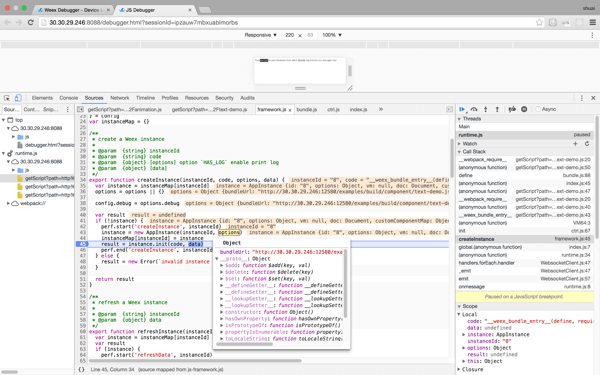

### Weex devtools

Weex devtools is a custom devtools for weex that implements [Chrome Debugging Protocol](https://developer.chrome.com/devtools/docs/debugger-protocol), it is designed to help you quickly inspect your app and debug your JS bundle source in a chrome web page, both Android and IOS platform are supported.At present The devtools consist of two part : `Inspector` and `Debugger`. If you want it work well, you must install a `weex-devtool` as debug server.



#### Inspector
 Inspector can be used to show your `Element` \ `NetWork` \ `Console log` \ `ScreenCast` \ `BoxModel` \ `Native View` and so on.



##### Element


##### NetWork

###### show the total time and latency

###### show the header and response


##### Console


##### Resource


#### Debugger

 Debugger can be used to debug your bundle js source, you can set `Breakpoint` \ watch `CallStack`.
 


##### Breakpoint and CallStack



#### How to install and launch devtools server

[weex-devtool](https://github.com/weexteam/weex-devtool) is essential no matter running on Android or IOS.


###### Install
```
$npm install -g weex-devtool
```

######  Usage

`$weex-devtool`  # launch debugger server

`$weex-devtool -p 8888`  # launch debugger server and set the server port

#### How to debug with chrome devtools

##### Android

See the doc [Weex devtools](../../android/inspector/README.md), it will lead you to config and use it step by step.


