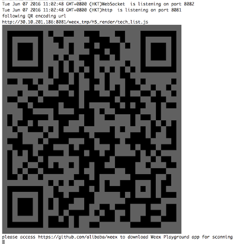
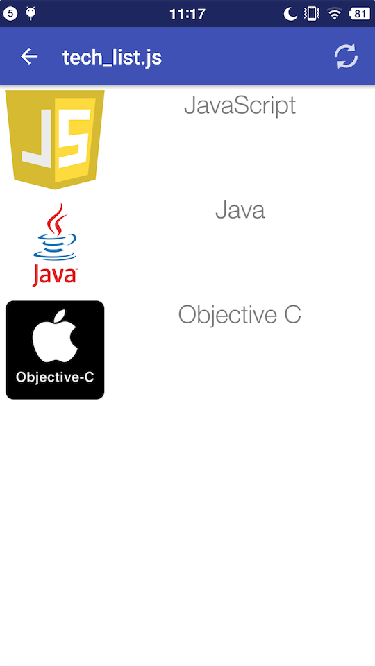

# Tutorial

<span class="weex-version">0.4</span>
<a href="https://github.com/weexteam/article/issues/4"  class="weex-translate">cn</a>

For this tutorial, we will make a simple list which demonstrates the basic functionality of Weex. This type of list is  used in many e-commerce apps and mobile sites.

## Getting Started

Let's get started with the following list item, which contains one `image` element and one `text` element.

```html
<template>
  <div class="container">
    <div class="cell">
        <image class="thumb" src="http://t.cn/RGE3AJt"></image>
        <text class="title">JavaScript</text>
    </div>
  </div>
</template>

<style>
  .cell { margin-top: 10; margin-left: 10; flex-direction: row; }
  .thumb { width: 200; height: 200; }
  .title { text-align: center; flex: 1; color: grey; font-size: 50; }
</style>
```

You can copy and paste the above code into a Weex file named `tech_list.we` (`.we` is our recommended filename extension).

## Preview

Before we run the resulting `.we` file, we should make sure the necessary dependencies have been installed.

First install [Node](https://nodejs.org/en/download/), which our Weex CLI program [Weex Toolkit](https://www.npmjs.com/package/weex-toolkit) depends on. Then install `weex-toolkit` by running the command:

```
npm install -g weex-toolkit
```

When the installation has been completed, you can check if Weex CLI was installed properly by running `weex` in the command line. The following text is expected:

```
Usage: weex foo/bar/your_next_best_weex_script_file.we  [options]

Options:
  --qr     display QR code for native runtime,
  -o,--output  transform weex we file to JS Bundle, output path (single JS bundle file or dir)
  -s,--server  start a http file server, weex .we file will be transforme to JS bundle on the server , specify local root path using the option  
  ......
  --help  Show help         
  -h, --host [default: "127.0.0.1"]
```

If everything looks good, navigate to the directory where you saved `tech_list.we`, then type:

```
weex tech_list.we
```

A browser window will be opened automatically to display the live result below     (weex-toolkit version should be greater than 0.1.0; use `weex --version` to check):


## Introduction to Weex Syntax

Now let's take a closer look at the basic syntax.

By looking at the contents of `tech_list.we`, we can see that Weex source code is composed of three parts -- *template*, *style*, and *script*, just like html, css, and javascript for the Web.

The template is the skeleton that gives Weex structure. It is composed of tags which surround content and apply meaning to it. Just as with html, each Weex tag is comprised of an opening tag and a closing tag. Tags have *attributes*, and each attribute has a different meaning. For example, the `class` attribute makes it possible to define styles for multiple tags, and the `onclick` attribute makes the tag respond to a click event.

Style describes how Weex tags are to be displayed. We, like you, love CSS, so we try to stay consistent with the CSS standard as much as possible. Weex Style supports many CSS features, such as margin, padding, and fixed. Better yet, flexbox layout (flex) is well supported in Weex Style.

The Weex Script adds *data* & *logic* to Weex tags, helping you easily access local or remote data and update tags. You can also define some methods for your tag to respond to different events. Weex Script organization is heavily influenced by CommonJS module style.

More information about Weex syntax can be found in our [Syntax chapter](syntax/main.md).

## Add More Items

Right now our example only has one entry, so we can't really call it a list. Let's fix that by opening`tech_list.we` in your favorite editor and updating its contents with the following code:

```html
<template>
  <div class="container">
    <div class="cell">
        <image class="thumb" src="http://t.cn/RGE3AJt"></image>
        <text class="title">JavaScript</text>
    </div>
    <div class="cell">
        <image class="thumb" src="http://t.cn/RGE3uo9"></image>
        <text class="title">Java</text>
    </div>
    <div class="cell">
        <image class="thumb" src="http://t.cn/RGE31hq"></image>
        <text class="title">Objective C</text>
    </div>
  </div>
</template>

<style>
  .cell{ margin-top:10 ; margin-left:10 ; flex-direction: row; }
  .thumb { width: 200; height: 200; }
  .title { text-align: center ; flex: 1; color: grey; font-size: 50; }
</style>
```

Now we will try to render our `tech_list.we` with the Weex native renderer. Open your terminal and  navigate to the directory where you saved the `tech_list.we` again, then type:

```
weex tech_list.we --qr -h {ip or hostname}
```

It's ***RECOMMENDED*** to use the `-h` option to specify your local ip address or hostname.

A QR code will be displayed in the terminal window:



The QR code works together with [Weex Playground App](http://alibaba.github.io/weex/download.html). Open the app and tap the scan icon at the top-right corner, then scan the QR code displayed in your terminal. If all works well, a beautiful list will be displayed on your phone.



Here, I must stress that the list is rendered by a native view, instead of Webkit, so your app loads faster and has less memory overhead than a common Webview renderer.

Now open `tech_list.we` again and try to change some text. After the changes have been saved the Weex playground App will immediately display the updated text. We call this **Hot-Reload**, which is intended to help make developing with Weex faster and more convenient.

## Add Built-in Components

Instead of writing basic tags by yourself, Weex provides a lot of built-in components. For example, a Slider is common to many apps and mobile websites, so Weex includes a built-in Slider that you can easily use in your own scripts. Open `tech_list.we` and update its contents as follows:

```html
<template>
  <div style="flex-direction: column;">
    <slider class="slider" interval="{{intervalValue}}" auto-play="{{isAutoPlay}}" >
      <div class="slider-pages" repeat="{{itemList}}" onclick="goWeexSite" >
        <image class="thumb" src="{{pictureUrl}}"></image>
        <text class="title">{{title}}</text>
      </div>
    </slider>

  <div class="container" onclick="goWeexSite" >
    <div class="cell">
        <image class="thumb" src="http://t.cn/RGE3AJt"></image>
        <text class="title">JavaScript</text>
    </div>
    <div class="cell">
        <image class="thumb" src="http://t.cn/RGE3uo9"></image>
        <text class="title">Java</text>
    </div>
    <div class="cell">
        <image class="thumb" src="http://t.cn/RGE31hq"></image>
        <text class="title">Objective C</text>
    </div>
  </div>
</template>

<style>
  .cell { margin-top:10 ; margin-left:10 ; flex-direction: row; }
  .thumb { width: 200; height: 200; }
  .title { text-align: center ; flex: 1; color: grey; font-size: 50; }
  .slider {
    margin: 18;
    width: 714;
    height: 230;
  }
  .slider-pages {
    flex-direction: row;
    width: 714;
    height: 200;
  }
</style>

<script>
module.exports = {
    data: {
      intervalValue:"1000",
      isShowIndicators:"true",
      isAutoPlay:"true",
      itemList: [
        {title: 'Java', pictureUrl: 'http://t.cn/RGE3uo9'},
        {title: 'Objective C', pictureUrl: 'http://t.cn/RGE31hq'},
        {title: 'JavaScript', pictureUrl: 'http://t.cn/RGE3AJt'}
      ]
    },
    methods: {
      goWeexSite: function () {
        this.$openURL('http://alibaba.github.io/weex/')
      }
    }
}
</script>
```

Open a terminal and run the `weex` command again:

```
weex tech_list.we
```

You should see a slider prepended to our list.


More information about the Slider component can be found [here](components/slider.md).

Just as the previous example, the Slider can be rendered in native, in the Weex playground app, or in your App. Please refer to [the documentation](advanced/integrate-to-android.md) for more information on integrating Weex into your App.
