# 一、框架介绍

当前 Weex 框架，没有鸿蒙 SDK 版本。Weex-Web 替代方案路线与 weex 鸿蒙平台 SDK 路线不同，使用了 **ArkWeb** + **原生ArkTS** 混合方式替代 Weex 1.0 框架，没有对 Weex 框架自身侵入式增加鸿蒙端平台的适配， 而是提供 babel/webpack 插件等脚本，在编译期对 weex 工程进行少许源码改动，注入鸿蒙相关适配代码，最后打包成bundle产物运行在 ArkWeb 容器来达到鸿蒙化 weex 项目的目的。

# 二、架构介绍

Weex-Web 方案的能力封装在 `webScenekitHsp` 中，包括页面管理、跨页面通信、全局监听事件、模版预热、双端通信、自定义拓展组件等。

- 页面管理： 核心服务，实现全局路由和web容器资源统一管理，支撑weex鸿蒙化页面调度场景；
- 跨页面通信： 提供 `BroadcastChannel` 机制允许页面之间进行通信；
- 全局监听事件： 提供 `GlobalEvent` 机制监听全局事件；
- 模板预热： 对高频页面提前进行预渲染；
- 双端通信： Web 环境与原生环境交互，提供注册 API 通道，允许 Web 环境通过通道访问原生侧；
- 自定义拓展组件： 使用Web组件的同层渲染能力，允许用户拓展自定义组件。

# 三、环境搭建

## 3.1 weex 工程编译打包

### 3.1.1 安装 nodejs 版本

注意：建议14版本，实际使用请根据工程环境而定

### 3.1.2 安装Weex CLI

通过官网[设置开发环境 | WEEX (weexapp.com)](https://weexapp.com/zh/guide/develop/setup-develop-environment.html#%E5%AE%89%E8%A3%85%E4%BE%9D%E8%B5%96)安装脚手架工具并初始化项目。
注意：使用weex -v 查看版本号为：Weex CLI version 2.0.0-beta.32

### 3.1.2 Weex项目鸿蒙化打包配置

#### 3.1.2.1 添加鸿蒙化打包命令及项目依赖

在package.json中添加鸿蒙编译打包命令

```shell
"build:harmony": "cross-env NODE_ENV=harmony apiEnv=prod ISHARMONY=true webpack --env.NODE_ENV=harmony",
```

由于新建weex项目中依赖版本过老，可直接替换以下版本依赖，其中`@ohos/weex-harmony`依赖包是由ohos/weex-openharmony工程中执行npm pack命令生成本地tgz包。

```json
"dependencies": {
    "@antv/f2": "^3.3.9",
    "@babel/polyfill": "^7.12.1",
    "@babel/runtime": "^7.18.9",
    "@ohos/weex-harmony": "D:/works/weex-master/ohos/weex-openharmony/ohos-weex-harmony-1.0.5.tgz",
    "console": "^0.7.2",
    "core-js": "^3.23.5",
    "crypto-js": "^4.0.0",
    "file-loader": "^5.0.2",
    "gcanvas.js": "0.0.8",
    "phantom-limb": "0.0.1",
    "protobufjs": "^6.10.2",
    "vue": "^2.6.11",
    "weex-bindingx": "0.0.49",
    "weex-vue-render": "^1.0.17",
    "weixin-js-sdk": "^1.6.0",
    "wolfy87-eventemitter": "^5.2.6"
  },
  "devDependencies": {
    "@appworks/doctor": "^0.4.1",
    "@babel/core": "^7.18.9",
    "@babel/plugin-transform-runtime": "^7.18.9",
    "@babel/preset-env": "^7.18.9",
    "@vue/compiler-dom": "^3.4.27",
    "address": "^1.1.2",
    "autoprefixer": "^8.0.0",
    "babel-eslint": "^8.2.1",
    "babel-helper-vue-jsx-merge-props": "^2.0.3",
    "babel-loader": "^8.0.0",
    "babel-plugin-component": "^1.1.1",
    "babel-plugin-syntax-jsx": "^6.18.0",
    "babel-plugin-transform-vue-jsx": "^3.5.0",
    "clean-webpack-plugin": "^3.0.0",
    "concurrently": "^8.2.2",
    "cross-env": "^7.0.3",
    "css-loader": "^1.0.0",
    "eruda": "^2.11.2",
    "eslint": "^5.12.0",
    "eslint-config-standard": "^12.0.0",
    "eslint-friendly-formatter": "^4.0.1",
    "eslint-loader": "^2.1.1",
    "eslint-plugin-import": "^2.14.0",
    "eslint-plugin-node": "^8.0.1",
    "eslint-plugin-promise": "^4.0.1",
    "eslint-plugin-standard": "^4.0.0",
    "eslint-plugin-vue": "^5.1.0",
    "extract-text-webpack-plugin": "^3.0.2",
    "filemanager-webpack-plugin": "^2.0.5",
    "friendly-errors-webpack-plugin": "^1.6.1",
    "fs-extra": "^5.0.0",
    "glob": "^7.1.2",
    "himalaya": "^1.1.0",
    "html-webpack-plugin": "^3.2.0",
    "html-webpack-plugin-for-multihtml": "^2.30.2",
    "ip": "^1.1.5",
    "less": "^3.8.0",
    "less-loader": "^4.1.0",
    "mini-css-extract-plugin": "^0.4.1",
    "node-notifier": "^5.1.2",
    "optimize-css-assets-webpack-plugin": "^5.0.0",
    "patch-package": "^8.0.0",
    "portfinder": "^1.0.13",
    "postcss-import": "^11.0.0",
    "postcss-loader": "^2.0.9",
    "postcss-plugin-weex": "^0.1.6",
    "qrcode-terminal": "^0.12.0",
    "raw-loader": "^0.5.1",
    "rimraf": "^2.6.2",
    "script-ext-html-webpack-plugin": "^1.8.5",
    "uglifyjs-webpack-plugin": "^1.2.7",
    "url-loader": "^3.0.0",
    "vconsole": "^3.15.1",
    "vue-loader": "^15.2.6",
    "vue-style-loader": "^4.1.1",
    "vue-template-compiler": "^2.6.11",
    "webpack": "^4.16.3",
    "webpack-bundle-analyzer": "^4.8.0",
    "webpack-cli": "^3.1.0",
    "webpack-dev-middleware": "^3.1.3",
    "webpack-dev-server": "^3.1.5",
    "webpack-hot-middleware": "^2.22.3",
    "webpack-merge": "^4.1.4",
    "weex-vue-loader": "^0.7.0",
    "weex-vue-precompiler": "^0.1.26"
  }
```

#### 3.1.2.2 新增鸿蒙环境打包配置

在ohos/example目录下的weex-example样例工程中configs目录下获取`webpack.harmony.conf.js`文件并添加到本地weex项目中。
在`webpack.harmony.conf.js`鸿蒙环境打包配置中打包所需的文件结构目录如下所示：

```markup
└── weex-example               # 所有项目的集合
    └── src                    # 项目名称，项目是一些html网页按照业务划分的集合，由伙伴定义
       ├── assets              # 字体、样式资源目录
       ├── components          # 组件目录
       ├── images              # 图片资源目录
       ├── pages               # 页面入口目录
       └── web                 # H5页面资源目录                    
```

#### 3.1.2.3 修改替换公共打包配置并引入编译打包时执行loader插件

在ohos/example目录下的weex-example样例工程中configs目录下获取`webpack.dev.conf.js` 、`webpack.common.conf.js`、`qrcode-w-plugin.js`、`config.js`、`utils.js`、`transform-loader.js`文件并添加并替换到本地weex项目中。

#### 3.1.2.4 修改webpack打包配置文件

在项目根目录下的webpack.config.js打包配置文件中增加鸿蒙环境下引用的打包插件

```javascript
case 'harmony': 
      webpackConfig = require('./configs/webpack.harmony.conf');
      break;
```

#### 3.1.2.5 新增和修改babel配置文件并引入自定义babel插件

1. 在`.babelrc`文件中替换如下预设babel插件:
   
   ```json
   {
     "presets": [
       [
         "@babel/preset-env",
         {
           "modules": false, // 将esModule语法转化为其他模块语法
           "useBuiltIns": "usage", // 处理垫片引入方式，usage为按需引入
           "corejs": 3
         }
       ]
     ],
     "plugins": [["@babel/plugin-transform-runtime"], [
       "component",
       {
         "libraryName": "@umetrip/ume-weex-ui",
         "libDir": "packages",
         "style": false
       }
     ]]
   }
   ```
2. 在项目根目录下创建`babel.config.js`文件，并配置`weexTransform.js`转换插件
   
   ```javascript
   module.exports = {
     plugins: ['./configs/weexTransform.js']  
   }
   ```
3. 在ohos/example目录下的weex-example样例工程中configs目录下获取`weexTransform.js`文件并添加到本地weex项目中。
#### 3.1.2.6 修改src/entry.js入口文件并初始化
```javascript
import Vue from 'vue';

import weex from 'weex-vue-render';

const VConsole = require('vconsole');

if (!window.location.href.includes('static')) {
    // eslint-disable-next-line no-new
    new VConsole({ theme: 'dark' });
}

weex.init(Vue);
```


### 3.1.3 安装依赖以及启动编译

```shell
npm install
npm run build:harmony
```

在工程目录下会生成编译产物frameworkTest_harmony_web.zip，解压后的frameworkTest_web文件夹为后续需要使用的web资源

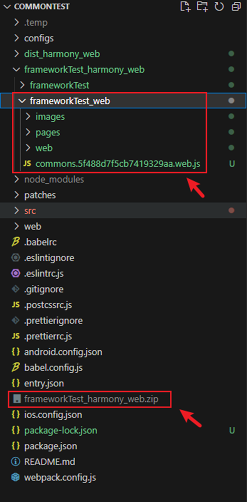

## 3.2 webScenekitHsp 集成

1）将ohos目录下的web_scenekit_hsp文件夹复制到需要集成的工程目录下，如下所示

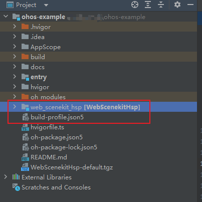

2）在工程根目录下的build-profile.json5中配置module字段，如下所示

```json
"modules": [
  {
    "name": "entry",
    "srcPath": "./entry",
    "targets": [
      {
        "name": "default",
        "applyToProducts": [
          "default"
        ]
      }
    ]
  },
  {
      "name": "WebScenekitHsp",
      "srcPath": "./web_scenekit_hsp",
      "targets": [
        {
          "name": "default",
          "applyToProducts": [
            "default"
          ]
        }
      ]
    }
]
```

3）在entry模块的oh-package.json5中dependencies引入webSencekitHsp模块

```json
"dependencies": {
  "WebSceneKitHsp": "file:../web_scenekit_hsp"
}
```

4）webSencekitHsp模块的初始化

a、在entry模块下ets目录中创建GlobalThis.ets文件，然后在EntryAbility.ets(路径:src/main/ets/entryability/EntryAbility.ets)中的onCreate中保存context到GlobalThis中，供后续路由管理服务使用

```javascript
// GlobalThis .ets

export class GlobalThis {
  private constructor() {
  }

  private static instance: GlobalThis;
  private _uiContexts = new Map<string, Context>();

  public static getInstance(): GlobalThis {
    if (!GlobalThis.instance) {
      GlobalThis.instance = new GlobalThis();
    }
    return GlobalThis.instance;
  }

  getContext(key: string): Context | undefined {
    return this._uiContexts.get(key);
  }

  setContext(key: string, value: Context): void {
    this._uiContexts.set(key, value);
  }
}
onCreate(want: Want, launchParam: AbilityConstant.LaunchParam): void {
    GlobalThis.getInstance().setContext("GlobalContext", this.context)
    hilog.info(0x0000, 'testTag', '%{public}s', 'Ability onCreate');
  }
```

b、在EntryAbility.ets中的onWindowStageCreate中对ExtWebController初始化，同时将UIContext保存到AppStorage中

```javascript
import { ExtWebController } from 'WebSceneKitHsp';

...
onWindowStageCreate(windowStage: window.WindowStage): void {
    // Main window is created, set main page for this ability
    hilog.info(0x0000, 'testTag', '%{public}s', 'Ability onWindowStageCreate');

    windowStage.loadContent('pages/Index', (err, data) => {
      // 支持业务侧动态配置 将业务模块路径传入init 页面配置文件在每个业务模块根目录
      // 第一个参数为业务模块目录名，和rawfile下保持一致，最后一个参数是初始化web容器数量
      ExtWebController.init(['frameworkTest_web'], windowStage.getMainWindowSync().getUIContext(), this.context, 10);
      AppStorage.setOrCreate("uiContext", windowStage.getMainWindowSync().getUIContext());
    });
  }
```

5）将weex工程中编译生成的frameworkTest_web放到鸿蒙工程的entry/src/main/resources/rawfile下

6）ExtWeb组件加载web页面

对外提供的扩展web组件。可在IDE工程page页面的容器控件中加载ExtWeb组件，入参的url为需要加载的web页面的地址。

```ts
import { ExtWeb } from 'WebSceneKitHsp'
...
build() {
  Row() {
    Column() {
      ExtWeb({ url: 'resource://rawfile/frameworkTest_web/pages/index/entry.html' })
    }
    .width('100%')
  }
  .height('100%')
}
```

## 3.3 鸿蒙工程编译运行

注：DevEco Studio、SDK和 ROM 镜像需要使用5.0的版本

1. 将weex工程编译出的web资源拷贝到壳工程的entry/src/main/resources/rawfile目录下
2. 项目签名
   
   
3. 运行entry
   
   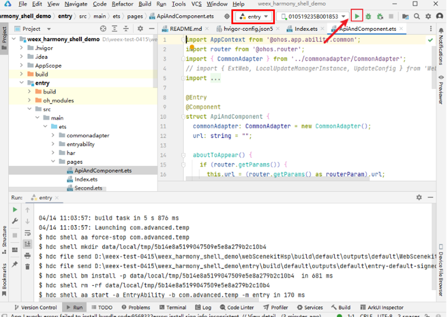

# 四、功能开发

## 4.1 WebSceneKitHsp

### 4.1.1 功能简介

WebSceneKitHsp为weex框架提供了增强web功能，包括页面管理、跨页面通信、全局监听事件、模版预热、web侧api调用原生api、高性能组件、自定义拓展组件等能力。

### 4.1.2 接口说明

#### 4.1.2.1 **ExtWeb组件**

扩展web组件，内部封装了页面管理服务、跨页通信、web实例预热、模版预热等功能。具体参数说明：

| 名称 | 类型   | 描述      | 是否必选 |
| ---- | ------ | --------- | -------- |
| url  | string | 加载的url | Y        |

#### 4.1.2.2 **ExtWebController**

对外提供的扩展web组件控制类, 具体接口有init、registerCustomFun以及triggerEvent。

##### 4.1.2.2.1 init接口

动态解析配置文件并初始化web资源实例池。具体参数说明：

| 名称      | 类型                    | 描述                      | 是否必选 |
| --------- | ----------------------- | ------------------------- | -------- |
| pathArray | Array[string]           | 业务模块根目录            | Y        |
| uiContext | UIContext               | UI上下文实例UIContext对象 | Y        |
| context   | common.UIAbilityContext | 上下文context             | Y        |
| poolSize  | number                  | 初始化web实例资源池数量   | N        |

##### 4.1.2.2.2 registerCustomFun接口

注入自定义ArkTs高阶api到WebSceneKit，在weex端即可直接调用。具体参数说明：

| 名称    | 类型     | 描述           | 是否必选 |
| ------- | -------- | -------------- | -------- |
| funName | string   | 注入的方法名称 | Y        |
| fun     | Function | 注入的方法     | Y        |

##### 4.1.2.2.3 triggerEvent接口

为Weex的GlobalEvent提供，可以在weex端自定义事件，在ArkTs端通过triggerEvent接口触发事件。具体参数说明：

| 名称      | 类型           | 描述               | 是否必选 |
| --------- | -------------- | ------------------ | -------- |
| eventName | string         | 自定义事件名       | Y        |
| data      | Object、string | 触发事件返回的数据 | N        |

##### 4.1.2.2.4 setUA接口

为业务方提供自定义设置ua属性接口。

| 名称 | 类型   | 描述     | 是否必选 |
| ---- | ------ | -------- | -------- |
| ua   | string | 自定义ua | Y        |

##### 4.1.2.2.5 refresh接口

提供refresh接口，支持刷新当前url的webview。

| 名称 | 类型   | 描述              | 是否必选 |
| ---- | ------ | ----------------- | -------- |
| url  | string | 当前需要刷新的url | Y        |

## 4.2 页面管理

页面管理服务主要包括全局路由、Navigation页面栈控制以及离线组件上下树管理等。属于ExtWeb的核心模块，具体架构如图所示：

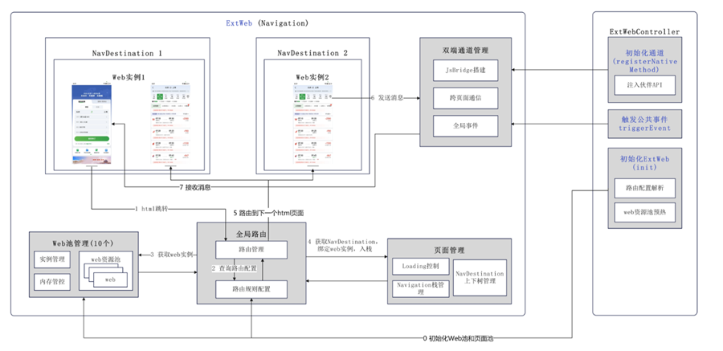

页面加载核心流程：初始化web池 -> 页面加载/跳转 -> 查询路由配置 -> 获取web实例 ->获取对应pageStack， push页面栈 -> NodeContainer上下树管理 -> 路由到目标html

### 4.2.1 方案

weex页面可分为以下4种，1、高频访问页面 2、不需要跨页面通信场景的页面 3、有跨页面通讯的页面 4、web和原生混合的页面，页面管理服务对不同的页面进行管理并提供针对性的加载策略。

1）针对高频访问的web页面，使用模版预热来提升页面加载速度，模版预热见3.3；

2）针对不需要跨页面通信场景的web页面，使用web容器共享来减少web实例的创建；

3）针对需要跨页面通信场景的web页面，使用多web实例进行加载，即一个页面对应一个web实例，当页面跳转后，web实例依然存在；

4）针对h5和原生的混合页面，如果混合页面跳转的目标页面为混合页面则不触发原生页面的跳转；

使用以上策略的页面管理服务在保证性能最优的情况下页面跳转和回退符合正常逻辑。

### 4.2.2 ExtWeb组件的初始化

调用ExtWebController的init接口，初始化ExtWeb组件。init过程会动态解析每个业务模块下的配置文件、初始化web实例资源池， ExtWeb的初始化需要在使用ExtWeb之前。建议在entryAbility的onWindowStageCreate中调用ExtWebController的init方法，参数poolSize最大值为10，大于10默认poolSize等于10。

```ts
onWindowStageCreate(windowStage: window.WindowStage) {
    // Main window is created, set main page for this ability
    hilog.info(0x0000, 'testTag', '%{public}s', 'Ability onWindowStageCreate');
    ExtWebController.setUA('');
    windowStage.loadContent('pages/Index', (err, data) => {
      // 支持业务侧动态配置 将业务模块路径传入init 页面配置文件在每个业务模块根目录
      // ExtWebController.init('WebSceneConfig.json', windowStage.getMainWindowSync().getUIContext(), this.context, 10);
      ExtWebController.init(['frameworkTest_web'], windowStage.getMainWindowSync().getUIContext(), this.context, 10);
      if (err.code) {
        hilog.error(0x0000, 'testTag', 'Failed to load the content. Cause: %{public}s', JSON.stringify(err) ?? '');
        return;
      }
      AppStorage.setOrCreate("uiContext", windowStage.getMainWindowSync().getUIContext());
      hilog.info(0x0000, 'testTag', 'Succeeded in loading the content. Data: %{public}s', JSON.stringify(data) ?? '');
      AppStorage.setOrCreate<UIContext>("UIContext", windowStage.getMainWindowSync().getUIContext());
    });
  }
```

如果跳转页面过多，web资源池中的空余web耗尽时，会在webSceneKitHsp中动态创建新的web资源。

```ts
public getWebInstanceId(reuse: boolean, url?: string): number {
  ...
  // if the webIdleMap size less than minimumThreshold, new web
  if (this.webIdleMap.size <= this.minimumThreshold) {
    const currentSize: number = this.webIdleMap.size + this.webUsedMap.size;
    this.createNormalWebInstance(this.uiContext as UIContext, currentSize + 1, 2);
  }
  ...
}
```

### 4.2.3 ExtWeb组件的使用

对外提供的扩展web组件。可在page页面的容器控件中加载ExtWeb组件，入参的url为首页的url。

```ts
build() {
  Row() {
    Column() {
      ExtWeb({ url: this.url })
    }
    .width('100%')
  }
  .height('100%')
}
```

### 4.2.4 配置文件说明

配置文件需要放在entry模块的rawfile目录下，建议放在每个业务根目录。配置文件中各字段需要按照如下格式定义：

```markup
└── weexProjects                 # 所有项目的集合
    ├── projectName              # 项目名称，项目是一些html网页按照业务划分的集合，由伙伴定义
    ├── urls                     # 当前项目下的的url地址和type类型
    │   ├── url                  # url地址
    │   └── type                 # 对应的类型，在下文介绍                                
    └──preLoad                   # 当前项目需要预加载的项目
```

type类型说明：

type：1 模板预热类型，适用于高频访问且无白屏场景的页面，快速加载页面，性能持平原生跳转。
type：2 多页面多web实例，适用于有跨页面通讯场景的页面，支持broadcastChannel和globalEvent；
type：3 多页面单web实例，适用于不需要跨页面通讯的页面，默认类型。

type：4 混合页面，有两种情况： 1）加载的web和原生组件在同一个Page页；2）原生page使用多个ExtWeb组件。

注：没有配置的页面默认为type2

示例代码：

项目weexProject里的resource://rawfile/frameworkTest_web/pages/index/entry.html， 该url地址不需要支持跨页通信，所以配置为 type：3

```json
...
"projectName": "weexProject",
"urls": [
    {
        "url": "resource://rawfile/frameworkTest_web/pages/index/entry.html",
        "type": 3
    },
    ...
]
...
```

项目weexProject里的resource://rawfile/frameworkTest_web/pages/mapTest1/entry.html， 该url地址使用跨页通讯接口（broadcastChannel、globalEvent），所以配置为 type：2

```json
"projectName": "weexProject",
 "urls": [
    ...
    {
      "url": "resource://rawfile/frameworkTest_web/pages/mapTest1/entry.html",
      "type": 2
    },
    ...
    ]
...
```

机票项目某些页面是高频触发场景，需要加载无白屏效果，因此在"测试"项目中需要配置preload为"机票"，实现预加载机票项目。

```json
...
{
    "projectName": "测试",
    "urls": [
        {
          "url": "https://www.example.com",
          "type": 3
        }
      ],
    "preLoad": [
        "机票"
      ]
    },
...
```

为了配合预加载机票项目，"机票"项目下高频的url模版需配置为type：1，保证高频场景的页面能快速加载且无白屏效果。

```json
...
{
    "projectName": "机票",
    "urls": [
        {
          "url": "https://www.example.com",
          "type": 1
        },
       {
          "url": "https://www.example.com",
          "type": 3
        },
        {
          "url": "https://www.example.com",
          "type": 3
        },
        {
          "url": "https://www.example.com",
          "type": 1
        }
      ],
}
...
```

## 4.3 模版预热

### 4.3.1 方案

模板预热可以将重要页面模板（不带参数）预先加载，在跳转时解析url后的拼接参数，通过history.pushState方法将参数传递进去，进行局部渲染。


### 4.3.2 路由配置文件

首先在路由配置文件中将需要预热的url的type设置为1，并且将该业务模块所依赖的模块配置在preload中。路由配置文件的介绍见[4.2.4](###4.2.4配置文件说明)。

```markup
└── weexProjects                 # 所有项目的集合
    ├── projectName              # 项目名称，项目是一些html网页按照业务划分的集合，由伙伴定义
    ├── urls                     # 当前项目下的的url地址和type类型
    │   ├── url                  # url地址
    │   └── type                 # 对应的类型，在下文介绍                                
    └──preLoad                   # 当前项目需要预加载的项目
```

### 4.3.3 解析配置文件

在EntryAbility.ets调用init方法解析路由配置文件，解析配置文件过程中会读取type为1的所有url。

```ts
ExtWebController.init(['web'], windowStage.getMainWindowSync().getUIContext(), this.context, 10);
```

首先将每个业务模块下type为1，也就是需要进行预热的url（未带参数）和该模块依赖的其余模块存储在Project类中。并且以模块名为key值，Project类为value。以下实现已封装在webSencekitHsp中。

```ts
let projects: Map<string, Project> = new Map();
public static parseConfig(context: common.UIAbilityContext, path: string): Promise<void> {
  return new Promise((resolve, reject) => {
    context.resourceManager.getRawFileContent(path).then((data: Uint8Array) => {
      let jsonObject = JSON.parse(ParseUtil.bufferToString(data.buffer)) as Record<string, Array<JsonProject>>;
      let weexProjects = jsonObject.weexProjects as Array<JsonProject>;
      weexProjects.forEach((jsonProject: JsonProject) => {
        let preloadUrls: Array<string> = new Array();
        // 将模块下所有type为1的url存储在preloadUrls中
        jsonProject.urls.forEach((urlParams: UrlParams) => {
          urlConfig.set(urlParams.url, new UrlInfo(urlParams.type, jsonProject.projectName));
          if (urlParams.type === 1) {
            preloadUrls.push(urlParams.url);
          }
        })
        let project: Project = new Project(preloadUrls, jsonProject.preLoad);
        projects.set(jsonProject.projectName, project);
      })

      // 如果项目A依赖B，那么B也要依赖A，否则从B回退A，会重新刷新界面
      projects.forEach((value: Project, key: string) => {
        value.preLoadProjects.forEach((preLoadProjectName: string) => {
          if (!projects.get(preLoadProjectName)?.preLoadProjects.includes(key)) {
            projects.get(preLoadProjectName)?.preLoadProjects.push(key);
          }
        })
      })

      // 如果项目需要依赖自己
      projects.forEach((value: Project, key: string) => {
        if (!value.preLoadProjects.includes(key)) {
          value.preLoadProjects.push(key);
        }
      })

      RouterStorage.getInstance().urlConfig = urlConfig;
      RouterStorage.getInstance().projectsConfig = projects;
      resolve()
    }).catch((error: BusinessError) => {
      ...
    })
  })
}
```

### 4.3.4 预热模板

将预热url以及依赖项构建完毕后，在页面跳转时根据当前url所在的模块获取所有需要预热的url，执行addProject方法预热模板。以下实现已封装在webSencekitHsp中。

```ts
public preloadTemplate(routerUrl: string) {
  ...
  // 需要预热的模板
  let preLoadProjects: Array<string> | undefined = RouterStorage.getInstance()
    .projectsConfig
    .get(projectName)?.preLoadProjects;

  // 当前预热的模板
  let currentProjects: Map<string, Map<string, string>> = WebManager.getInstance().preloadStatus;

  let addProjects: Array<string> = new Array();
  let deleteProjects: Array<string> = new Array();
  // 获取当前预热模板，如果不包含需要预热模块，则添加进addProjects
  preLoadProjects?.forEach((preLoadProject: string) => {
    if (!currentProjects.has(preLoadProject)) {
      addProjects.push(preLoadProject);
    }
  })
  currentProjects.forEach((value: Map<string, string>, key: string) => {
    if (!preLoadProjects?.includes(key)) {
      deleteProjects.push(key);
    }
  })

  if (preLoadProjects?.length === 0 && deleteProjects.length === 0) {
    return;
  }

  // 删除冗余模版
  WebManager.getInstance().deleteProject(deleteProjects);

  // 预热模版
  WebManager.getInstance().addProject(addProjects);
}
```

addProject方法一共做了两件事：1. 遍历需要提前预热的业务模块下的所有url（未带参数），并将url的状态值设置成'initial'；2. 为预热url（未带参数）配备一个web实例，执行controller的loadurl。

```ts
public async addProject(addProjects: Array<string>) {
  let taskUrls: Array<string> = new Array();
  addProjects.forEach((addProjectName: string) => {
    let preloadUrls: Array<string> | undefined = RouterStorage.getInstance()
      .projectsConfig
      .get(addProjectName)?.preloadUrls;
    let projectsStatusMap: Map<string, string> = new Map();
    preloadUrls?.forEach((preloadUrl: string) => {
      projectsStatusMap.set(preloadUrl, Constant.STATUS_INITIAL);
      taskUrls.push(preloadUrl);
    })
    this.preloadStatus.set(addProjectName, projectsStatusMap);
  })

  taskUrls.forEach((url: string) => {
    if (this.templateIdleMap.size === 0) {
      return;
    }
    let webId: number = this.templateIdleMap.keys().next().value;
    let controller: web_webview.WebviewController | undefined = this.webControllerMap.get(webId);
    controller?.clearHistory();
    let builderNode: BuilderNode<BuilderData[]> | undefined = this.templateIdleMap.get(webId);
    if (builderNode) {
      this.templateUsedMap.set(webId, builderNode);
      this.templateIdleMap.delete(webId);
    }
    this.templateUrlMap.set(url, webId);
    url = UrlUtil.addFakeDomain(url);
    controller?.loadUrl(url);
  })
}
```

在url渲染完成后，执行refreshStatus将url的状态值设置成'finish'。

```ts
public refreshStatus(url: string) {
    let fakeDomain: string = Constant.FAKE_DOMAIN;
    if (url.startsWith(fakeDomain)) {
      url = url.substring(fakeDomain.length);
    }
    let projectName: string = RouterStorage.getInstance().getProjectName(url);
    this.preloadStatus.get(projectName)?.set(url, 'finish');
  }
```

### 4.3.5 局部刷新

预热成功后，在页面跳转时将url（带参数）的拼接参数截取出来执行history.pushState控制业务页面局部刷新，weex工程需要封装pushState监听事件。以下实现已封装在webSencekitHsp中。


```ts
// GlobalRouter.ets
let params = UrlUtil.getUrlParams(routerUrl);
webManagerInstance.getWebController(webId)?.runJavaScript(`reloadUrl(\"${params}\")`);
if (WebManager.getInstance().isPreloadFinish(routerUrl)) {
  PageModelController.getInstance().loading(false);
}
```

## 4.4 web侧Api调用系统Api

部分web侧api需要调用系统api，如获取蓝牙、wifi信息等，以下介绍如何实现从web的api调用到系统的api。

### 4.4.1 编译打包

weex 模块鸿蒙化是在编译打包过程中对module的导入进行语法树分析，将需要桥接到原生的module转为引用weex-harmony模块，在weex-harmony中通过jsBridge桥接到原生，在鸿蒙原生进行实现。在此过程中需要用户做4步操作 1、添加自定义babel插件 2、babel插件的实现（可直接复用模版） 3、在package.json中引入weex-harmony插件 4、在打包命令中添加ISHARMONY=true


#### 4.4.1.1 在babel.config.js文件中添加自定义babel插件

此自定义插件的作用是在编译时进行抽象语法树分析，将weex.requireModule转为 `require('@ohos/weex-harmony')`

```javascript
module.exports = {
  plugins: ['./configs/weexTransform.js']  
}
```

#### 4.4.1.2 自定义babel插件实现

自定义babel插件weexTransform.js文件内容如下，文件路径可自定义，但需要和babel.config.js中配置的路径保持一致

```javascript
const weexExtModules = [
    'weexModule',
    'globalEvent',
    'clipboard',
    'navigator',
    'deviceInfo',
    'websocket',
]

function isNeedWeexExtProxy(module) {
    return (weexExtModules.indexOf(module) === -1) ? false : true;
}

module.exports = function({ types: t }) {
    return {
        name: "weexTransform",
        visitor: {
            StringLiteral(path, state) {
            },
            CallExpression(astPath) {
                const node = astPath.node
                const calleePath = astPath.get('callee')
                const callee = calleePath.node
                if (callee.type === 'MemberExpression') {
                    const args = astPath.node.arguments
                    if (
                        args.length === 1 &&
                        t.isStringLiteral(args[0]) &&
                        isNeedWeexExtProxy(args[0].value) &&
                        t.isIdentifier(callee.object) &&
                        callee.object.name === 'weex'
                    ) {
                        if (process.env.ISHARMONY === 'true') {
                            console.log('TestXXX weexTransform.js harmony process.env.ISHARMONY:' + process.env.ISHARMONY);
                            // callee.object = t.identifier('weexExt')

                            const parentPath = astPath.parentPath?.parentPath
                            const parentNode = parentPath?.node
                            if (parentNode && t.isVariableDeclaration(parentNode)) {
                                const key = args[0].value

                                const properties = [
                                    t.objectProperty(
                                        t.identifier(key),
                                        t.identifier(key),
                                        false,
                                        true
                                    )
                                ]
                                const objectPattern = t.objectPattern(properties)

                                const requireExpression = t.CallExpression(
                                    t.identifier('require'),
                                    [t.stringLiteral('@ohos/weex-harmony')]
                                )
                                const replaceNode = t.variableDeclaration('const', [
                                    t.variableDeclarator(objectPattern, requireExpression)
                                ])

                                parentPath.replaceWith(replaceNode)
                            } else {
                                if (parentNode && t.isCallExpression(parentNode)) {
                                    const callee = parentNode.callee
                                    const object = callee.object
                                    const requireModuleName = object.arguments[0].value

                                    const requireExpression = t.callExpression(
                                        t.identifier('require'),
                                        [t.stringLiteral('@ohos/weex-harmony')]
                                    )

                                    const memberExpression = t.memberExpression(
                                        requireExpression,
                                        t.identifier(requireModuleName)
                                    )

                                    parentNode.callee.object = memberExpression
                                }
                            }
                        } else {
                            console.log('TestXXX weexTransform.js not harmony process.env.ISHARMONY:' + process.env.ISHARMONY);
                        }
                    }
                }
            }
        }
    };
};
```

#### 4.4.1.3 添加适配层依赖包@ohos/weex-harmony

weex-harmony插件的作用是适配weex侧的api并桥接到原生调用鸿蒙原生侧的高阶Api，package.json中路径需要修改为本地tgz包文件路径，tgz包生成方式见[3.1.2.1](####3.1.2.1添加鸿蒙化打包命令及项目依赖)。


@ohos/weex-harmony 源码参考：

```javascript
let weexModule = {
  name: "weex扩展API",
  // 默认走同步
  // isAsync: 是否异步方式调用 native api
  callNative: function (name, paramObj, callback, isAsync = false) {
    // @ts-ignore
    native.run(name, paramObj, callback, isAsync);
  }
}

let clipboard = {
  name: "weex剪贴板事件",
  getString: function (callback) {
    weexModule.callNative('getString', "", callback);
  },
  setString: function (text) {
    let paramObj = {"message": text};
    weexModule.callNative('setString', paramObj, undefined);
  }
}

let deviceInfo = {
  name: "weex获取全屏高度",
  enableFullScreenHeight: function (callback) {
    weexModule.callNative('enableFullScreenHeight', null, callback);
  }
}

let navigator = {
  name: "weex导航事件",
  pop: function (options, callback) {
    weexModule.callNative('navigatorPop', options, callback);
  },
  push: function (options, callback) {
    weexModule.callNative('navigatorPush', options, callback);
  },
  replace: function (options, callback) {
    weexModule.callNative('navigatorReplace', options, callback);
  }
}

let globalEvent = {
  name: "weex监听全局事件",
  addEventListener: function (eventName, callback) {
    if (callback === undefined) {
      console.error("callback is undefined.");
      return;
    }

    let paramObj = {'eventName': eventName}
    weexModule.callNative('addEventListener', paramObj, callback);
  },
  removeEventListener: function (eventName) {
    let paramObj = {'eventName': eventName}
    weexModule.callNative('removeEventListener', paramObj, undefined);
  }
}

let errorHandlers = [];
let closeHandlers = [];
let openHandlers = [];
let messageHandlers = [];
let socket = null;
const WEB_SOCKET_NO_READY = 'WebSocket is not ready'

// 给error event事件添加一个data属性
function handleError(handlers, errorMsg) {
  const event = new Event('error');
  handlers.forEach(handler => handler(Object.defineProperty(event, 'data', {
    value: errorMsg,
    enumerable: true,
    writable: true
  })));
}

const websocket = {
  WebSocket: function (url, protocols) {
    // 重新创建socket对象，初始化socket
    if (socket) {
      errorHandlers = [];
      closeHandlers = [];
      openHandlers = [];
      messageHandlers = [];
      socket = null;
    }
    socket = new WebSocket(url, protocols !== undefined && protocols !== '' ? protocols : 'wss');

    socket.onopen = function handleOpen(event) {
      openHandlers.forEach(handler => handler(event));
    };

    socket.onmessage = function handleMessage(event) {
      messageHandlers.forEach(handler => handler(event));
    };

    socket.onclose = function handleClose(event) {
      closeHandlers.forEach(handler => handler(event));
    };
  },

  onopen: function (handler) {
    openHandlers.push(handler);
  },

  onmessage: function (handler) {
    messageHandlers.push(handler);
  },

  onerror: function (handler) {
    errorHandlers.push(handler);
  },

  onclose: function (handler) {
    closeHandlers.push(handler);
  },

  send: function (data) {
    if (socket != null) {
      try {
        socket.send(data);
      } catch (e) {
        handleError(errorHandlers, e.message)
      }
    } else {
      handleError(errorHandlers, WEB_SOCKET_NO_READY)
    }
  },

  close: function () {
    if (socket != null) {
      // socket存在即关闭
      try {
        socket.close();
        errorHandlers = [];
        closeHandlers = [];
        openHandlers = [];
        messageHandlers = [];
        socket = null
      } catch (e) {
        handleError(errorHandlers, e.message)
      }
    } else {
      handleError(errorHandlers, WEB_SOCKET_NO_READY)
    }
  }
}


let picker = {
  name: "weex 选择器",
  pick: function (options, callback) {
    weexModule.callNative('pick', { 'options': options }, callback);
  },
  pickDate: function (options, callback) {
    weexModule.callNative('pickDate', { 'options': options }, callback);
  },
  pickTime: function (options, callback) {
    weexModule.callNative('pickTime', { 'options': options }, callback);
  }
}

export {
  clipboard,
  weexModule,
  deviceInfo,
  navigator,
  globalEvent,
  websocket,
  picker
}

```

#### 4.4.1.4 在打包命令中添加ISHARMONY=true

此配置会在[4.4.1.2](####4.4.1.2自定义babel插件实现)的babel插件中使用，如下所示：

```markup
"build:harmony": "cross-env NODE_ENV=harmony apiEnv=prod ISHARMONY=true webpack --env.NODE_ENV=harmony",
```

### 4.4.2 自定义拓展模块

当前支持如下方法参数格式function (name, paramObj, callback)的自定义拓展module，自定义拓展模块步骤如下：

参数说明：

| 名称     | 类型     | 描述     | 是否必选 |
| -------- | -------- | -------- | -------- |
| name     | string   | 方法名   | Y        |
| paramObj | object   | 参数     | Y        |
| callback | Function | 回调方法 | Y        |

示例代码：

1、在[4.4.1.2](####4.4.1.2自定义babel插件实现)的babel插件的weexExtModules对象中添加自定义拓展模块名，如weexModule

```javascript
const weexExtModules = [
    'weexModule',
    'globalEvent',
    'clipboard',
    'navigator',
    'deviceInfo',
    'websocket',
]
```

2、在weex-harmony中实现weexModule，调用native.run(name, paramObj, callback)，native对象通过代理和jsBridge桥接到原生

```javascript
let weexModule = {
  name: "weex扩展API",
  callNative: function (name, paramObj, callback) {
    // @ts-ignore
    native.run(name, paramObj, callback);
  }
}
```

3、原生侧使用ExtWebController.registerCustomFun()注册自定义拓展模块的方法，可参考ohos包中example目录下的ohos-example项目下entry/src/main/ets/commonadapter目录下的CommonAdapter.ets，其中方法的实现可自定义实现


## 4.5 高性能组件

部分对性能有要求的组件需要原生组件的支持，以下介绍通过同层渲染将原生组件渲染到web页面上，提高页面渲染性能。

### 4.5.1 同层渲染简介

weex在android和ios侧提供Component拓展能力，不同于weex在android和ios侧映射到原生，weex鸿蒙化走web路线，因此，提供一种基于同层渲染的拓展组件能力，在web中使用embed标签，在原生侧解析并将对应的原生组件渲染在embed标签处

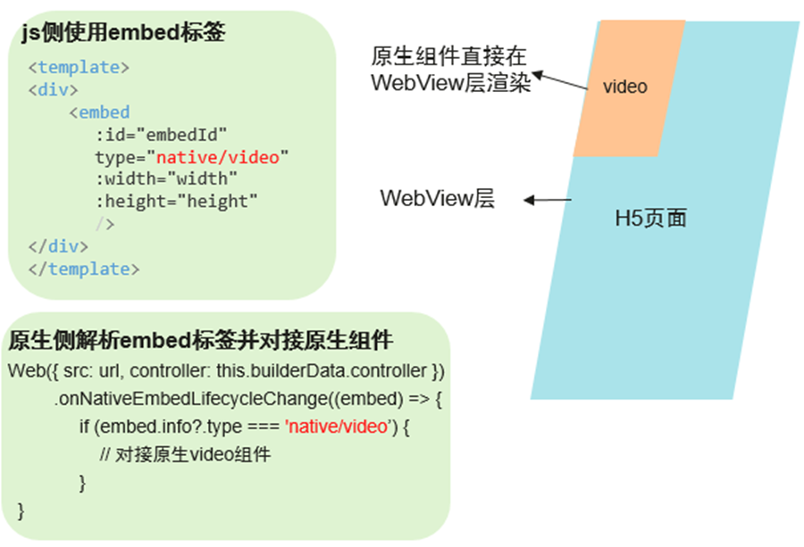

### 4.5.2 web侧自定义拓展组件实现

```vue
<template>
  <div>
    <embed
      class="embed-element"
      :id="embedId"
      type="native/video"
    />
  </div>
</template>

<script>
const weexModule = weex.requireModule("weexModule");

export default {
  name: "HlVideoTest",
  props: {
    src: {
      type: String,
      required: true,
    },
    controls: {
      type: Boolean,
      required: false,
    },
    autoPlay: {
      type: Boolean,
      required: false,
    },
    muted: {
      type: Boolean,
      required: false,
    },
    loop: {
      type: Boolean,
      required: false,
    },
  },
  data() {
    return {
      // 此处使用Vue实例的唯一ID来生成embed元素的唯一ID，仅供参考，也可以使用其它方式确保唯一，例如使用时间戳。
      embedId: `video_${this._uid}`, 
      isTransferScheduled: false,
    };
  },
  created() {
    this.transferPropsAndListeners(); // 组件创建时调用
  },
  methods: {
    transferPropsAndListeners() {
      // 原生组件所需的属性和方法，以对象方式传递
      const args = {
        componentId: this.embedId,
        src: this.src, // 要播放视频的资源地址
        controls: this.controls, // 是否显示播放控件
        muted: this.muted, // 是否静音
        loop: this.loop,
        autoPlay: this.autoPlay,
        onPlay: this.handleOnPlay,
        onPause: this.handleOnPause,
      };
      // 调用JSbridge方法，传递属性和监听方法到原生组件
      weexModule.callNative("transferSameLayerArgs", args);
    },
    scheduleTransfer() {
      if (!this.isTransferScheduled) {
        this.isTransferScheduled = true;
        this.$nextTick(() => {
          // 组件属性变化触发重新渲染时，也可以只传递变化了的属性到原生侧，但一定要包含componentId属性，例如传递{componentsId: this.componentId, controls: this.controls}
          this.transferPropsAndListeners();
          this.isTransferScheduled = false;
        });
      }
    },
    handleOnPlay(res) {
      this.$emit("onPlay", res);
    },
    handleOnPause(res) {
      this.$emit("onPause", res);
    },
  },
  watch: {
    src(newSrc, oldSrc) {
      if (newSrc !== oldSrc) {
        this.scheduleTransfer(); // 当src属性变化时重新调用
      }
    },
    muted(newMuted, oldMuted) {
      if (newMuted !== oldMuted) {
        this.scheduleTransfer(); // 当muted属性变化时重新调用
      }
    },
    controls(newControls, oldControls) {
      if (newControls !== oldControls) {
        this.scheduleTransfer(); // 当controls属性变化时重新调用
      }
    },
  },
};
</script>

<style scoped>
.embed-element {
  position: absolute;
  top: 0;
  left: 0;
  width: 100%;
  height: 100%;
}
</style>
```

在拓展组件实现时，1、可以通过vue的watch监听属性的变化，当属性更新时可通知原生进行更新；2、当多个属性同时更新时，可通过nextTick将数据一次传递到原生侧，减少通信次数。

embed标签参数说明：

| 名称 | 类型   | 描述                  | 是否必选 |
| ---- | ------ | --------------------- | -------- |
| id   | string | 唯一标识id            | Y        |
| type | string | 类型，需以native/开头 | Y        |

需要传递给原生端的属性和监听函数可通过jsBridge进行传递，其中weexModule.callNative("transferSameLayerArgs", args)已实现，用户不需要自己实现

```javascript
transferPropsAndListeners() {
  // 原生组件所需的属性和方法，以对象方式传递
  const args = {
    componentId: this.embedId,
    src: this.src, // 要播放视频的资源地址
    controls: this.controls, // 是否显示播放控件
    muted: this.muted, // 是否静音
    loop: this.loop,
    autoPlay: this.autoPlay,
    onPlay: this.handleOnPlay,
    onPause: this.handleOnPause,
  };
  // 调用JSbridge方法，传递属性和监听方法到原生组件
  weexModule.callNative("transferSameLayerArgs", args);
},
```

另外，用户也可以给自定义组件增加实例方法，比如自定义的Lottie组件中，定义了 play等方法，代码示例如下

```javascript
<template>
  <div>
    <embed class="embed-element" :id="embedId" type="native/lottie"/>
  </div>
</template>

export default {
  name: "HlLottie",
   methods: {
    play(callback) {
      weexModule.callNative('lottieHandle', {
        method: 'play',
        name: this.embedId,
      }, callback)
    },
    // 其他方法定义，省略
  },
  // 其他数据定义，省略
}
```

```javascript

// 使用Lottie组件， entry.vue 文件
<template>
  <hl-lottie ref="mylottie"/>
  <text class="playBtn" @click="playLottie"/>
</template>

<script>
export default {
  methods: {
    playLottie() {
      this.$refs.mylottie.play(() => {});
    },
  },
}
</script>

```

示例代码使用 this.$refs.mylottie.play 调用 Lottie 组件中的 play 方法，该方法使用weexModule.callNative("lottieHandle", ...) 访问原生侧的 lottieHandle API。

### 4.5.3 添加自定义loader

自定义拓展组件在android和ios都是以注册的方式，鸿蒙化时自定义拓展组件在web侧进行实现，在编译成鸿蒙产物时，需要引用到所在的文件，因此提供一个自定义loader在打包成鸿蒙产物时进行自动引用

1）自定义loader transform-loader.js实现

其中componentMap中需要配置自定义组件名和组件所在的文件名，自定义loader的运行需要在编译命令中添加字段ISHARMONY=true，参考[4.4.1.4](####4.4.1.4在打包命令中添加ISHARMONY=true)

```javascript
const compiler = require('vue-template-compiler')
const parser = require('@babel/parser')
const traverse = require('@babel/traverse').default
const generator = require('@babel/generator').default
const t = require('@babel/types')
const { parse } = require('himalaya')
const path = require('path')

let currentModulePath = ''

// 组件引入基路径，baseUrl的值为引入组件路径的公共部分
const baseUrl = '../src/components/'

/**
 * componentName:该属性的值是导入和注册组件时的组件名称，使用时请遵循Vue组件的命名和使用规范
 * 
 * componentAddress: 组件所在地址
 * 
 * isInPlugin: 是否从三方库引入
 */
const componentMap = [
  {
    componentName: 'HlRichtext',
    componentAddress: 'hl-richtext-base.vue',
    isInPlugin: false
  },
  {
    componentName: 'HlVideo',
    componentAddress: 'hl-video-base.vue',
    isInPlugin: false
  },
  {
    componentName: 'HlLottie',
    componentAddress: 'hl-lottie-base.vue',
    isInPlugin: false
  },
  {
    componentName: 'HlWeb',
    componentAddress: 'hl-web-base.vue',
    isInPlugin: false
  },
  {
    componentName: 'HlTextarea',
    componentAddress: 'hl-textarea-base.vue',
    isInPlugin: false
  },
  {
    componentName: 'HlButton',
    componentAddress: 'hl-button-base.vue',
    isInPlugin: false
  },
  {
    componentName: 'HlSlider',
    componentAddress: 'hl-slider-base.vue',
    isInPlugin: false
  }
]
const componentSet = new Set()

/**
 * 判断是否为windows环境
 * @returns 
 */
function isWin32(){
  if(process.platform === 'win32') {
    return true
  } else {
    return false
  }
}

/**
 * 处理解析标签名，将<hl-video>这种转为HlVideo
 * @param {*} tagName 
 */
function transformTagName(tagName) {
  if(tagName.includes('-')) {
    const nameSplit = tagName.split('-')
    return nameSplit.join('')
  }
  return tagName
}

function hasTargetElement(tagName) {
  let hasElement = false
  let componentName = ''
  componentMap.forEach((item) => {
    if(item.componentName.toLowerCase() === transformTagName(tagName)) {
      hasElement = true
      componentName = item.componentName
    }
  })

  return {
    hasElement,
    componentName
  }
}

/**
 * 遍历html节点，将需要引入的组件添加到componentSet中
 * @param {*} node html节点
 */
function traverseNode(node) {
  if (node.type === 'element') {
    const {hasElement, componentName} = hasTargetElement(node.tagName)
    if (hasElement) {
      componentSet.add(componentName)
    }
    if (node.children) {
      node.children.forEach((child) => {
        traverseNode(child)
      })
    }
  }
}

/**
 * 创建import组件导入节点
 * @param {*} componentName 组件名称
 * @returns 导入的ast节点
 */
function buildImportDeclaration(componentName) {
  let isInPlugin = getIsInPlugin(componentName)
  return t.importDeclaration(
    isInPlugin ? [t.importSpecifier(t.identifier(componentName), t.identifier(componentName), false, true)] : [t.importDefaultSpecifier(t.identifier(componentName))],
    t.stringLiteral(getComponentLoc(componentName))
  )
}

/**
 * 判断当前组件的引入是否是三方库引入
 * @param {*} componentName 
 */
function getIsInPlugin(name) {
  let isInPlugin = false
  componentMap.forEach((item) => {
    if(item.componentName === name) {
      isInPlugin = item.isInPlugin
    }
  })

  return isInPlugin
}

/**
 * 通过组件名称获取组件所在位置
 * @param {*} name 组件名称
 */
function getComponentLoc(name) {
  let address = ''
  let isInPlugin = false
  componentMap.forEach((item) => {
    if(item.componentName === name) {
      address = baseUrl + item.componentAddress
      isInPlugin = item.isInPlugin
    }
  })

  if (isInPlugin) {
    return address
  } else {
    return getAbsPath(address)
  }
}

/**
 * 根据引入的路径获取组件导入的路径
 * @param {*} address 
 * @returns 
 */
function getAbsPath(address){
  const componentAbsolute = path.resolve(__dirname, address)
  if(isWin32()) {
    return path.relative(currentModulePath, componentAbsolute).replace('..\\','').replace(/\\/g,'/')
  } else {
    return path.relative(currentModulePath, componentAbsolute).replace('../','')
  }
}

/**
 * 生产SFC代码
 * @param {*} moduleResoveRet 
 */
function generateCode(moduleResoveRet) {
  let styleTemplate = ''
  let styleAttrs = ''
  let scriptAttrs = ''

  moduleResoveRet.styles.forEach((item) => {
    styleTemplate += item.content
  })

  Object.keys(moduleResoveRet.script.attrs).forEach((item) => {
    if (typeof moduleResoveRet.script.attrs[item] === 'boolean') {
      scriptAttrs += ` ${item}`
    } else {
      scriptAttrs += ` ${item}="${moduleResoveRet.script.attrs[item]}"`
    }
  })

  if(moduleResoveRet.styles.length){
    Object.keys(moduleResoveRet.styles[0].attrs).forEach((item) => {
      if (typeof moduleResoveRet.styles[0].attrs[item] === 'boolean') {
        styleAttrs += ` ${item}`
      } else {
        styleAttrs += ` ${item}="${moduleResoveRet.styles[0].attrs[item]}"`
      }
    })
  }

  const template = `
<template>${moduleResoveRet.template.content}</template>
<script${scriptAttrs}>${moduleResoveRet.script.content}</script>
<style${styleAttrs}>${styleTemplate}</style>
  `
  return template
}

/**
 * 添加components对象
 * @param {*} data 
 */
function addComponentsProperty(data) {
  if (componentSet.size !== 0) {
    componentSet.forEach((value) => {
      if (!data.value.properties.some(item => item.value.name == value)) {
        const newProperty = t.objectProperty(t.identifier(value), t.identifier(value),false, true)
        data.value.properties.push(newProperty)
      }
    })
  }
}

module.exports = function (source) {
  if (process.env.ISHARMONY === 'true') {
    currentModulePath = this.resourcePath
    const moduleResoveRet = compiler.parseComponent(source)
    const { template, script, styles } = moduleResoveRet
    const tempAst = parse(template.content)
    tempAst.forEach((node) => {
      traverseNode(node)
    })

    // 单模块中引入了自定义组件
    if (componentSet.size !== 0) {
      const scriptAst = parser.parse(script.content, {
        sourceType: 'module',
        // 在此添加需要解析的插件
      })

      traverse(scriptAst, {
        Program(path) {
          componentSet.forEach((componentName) => {
            path.unshiftContainer('body', buildImportDeclaration(componentName))
          })
        },
        ExportDefaultDeclaration(path) {
          if (componentSet.size !== 0) {
            if (t.isObjectExpression(path.node.declaration)) {
              const properties = path.node.declaration.properties
              const result = properties.find(item => item.key.name == 'components')
              if (result) {
                addComponentsProperty(result)
              } else {
                const componentsAst = t.objectProperty(t.identifier('components'), t.objectExpression([]))
                properties.push(componentsAst)
                addComponentsProperty(componentsAst)
              }
            }
          }
        }
      })

      // 清除componentSet中的缓存，准备进入下次循环
      componentSet.clear()

      const { code } = generator(scriptAst)
      moduleResoveRet.script.content = code
      source = generateCode(moduleResoveRet)
    }
  }
  return source
}
```

2）自定义loader注册

`loader`配置代码如下：

```javascript
module.exports = {
  module: {
    rules: [
      {
        test: /\.vue(\?[^?]+)?$/,     // 配置解析.vue文件
        use: [
          {
            loader: path.resolve(__dirname, 'transform-loader.js'), // 引入自定义loader，transform-loader.js(和配置文件在同一目录) 来解析.vue文件
          }
        ],
      },
    ]
  },
};
```

因为不同的工程对于`.vue`解析配置的`loader`存在差异，可能存在对`.vue`使用多个`loader`解析的情况，因此在配置自定义`loder`时需要确保自定义`loader`最新执行，因此需要将该`loader`放到数组最后。示例代码如下：

```javascript
//webpack.common.conf.js
module.exports = {
  const webConfig = {
    module: {
      rules: [
        {
          test: /\.vue(\?[^?]+)?$/,
          use: [
          {
            loader: 'vue-loader',      // 使用三方Loader解析.vue文件
            options: {
              postcss: [require('autoprefixer')({ browsers: ['last 10 Chrome versions', 'last 5 Firefox versions', 'Safari >= 6', 'ie > 8'] })],
              compilerOptions: {
                modules: [
                  {
                    postTransformNode: el => {
                      // to convert vnode for weex components.
                      require('weex-vue-precompiler')()(el)
                    }
                  }
                ]
              }
            }
          },
          {
            loader: path.resolve(__dirname, 'transform-loader.js'), // 引入自定义loader解析.vue文件
          }
          ],
        },
      ]
    },
  }
};
```

### 4.5.4 原生侧组件的实现

原生侧组件可以通过params接收web侧自定义拓展组件传递过来的属性和方法并和自己的属性和方法进行绑定，在web侧还可以通过vue的watch来监听属性，当属性发生变化时立即通知原生侧做对应的更新。以下为原生侧自定义组件示例：

```javascript
import { sameLayerManager } from 'WebSceneKitHsp/Index';
import { VideoParams } from '../../interfaces/SameLayer';

@Component
export struct NativeVideo {
  @ObjectLink params: VideoParams
  videoController: VideoController = new VideoController();

  build() {
    Column() {
      Video({
        src: this.params.src,
        controller: this.videoController
      })
        .objectFit(ImageFit.Fill)
        .autoPlay(this.params.autoPlay ?? true)
        .muted(this.params.muted ?? false)
        .loop(this.params.loop ?? false)
        .controls(this.params.controls ?? true)
        .onClick((event) => {
          console.log('NativeEmbed video onClick.')
        })
        .onStart(() => {
          console.log('NativeEmbed video onPlay.', this.params.height)
          const callJsOnPlay: Function | undefined = (sameLayerManager.getSameLayerArgs(this.params.componentId) as VideoParams)?.onPlay
          callJsOnPlay && callJsOnPlay('Native Video playing.')
        })
        .onPause(() => {
          console.log('NativeEmbed video onPause.')
          const callJsOnPause: Function | undefined = (sameLayerManager.getSameLayerArgs(this.params.componentId) as VideoParams)?.onPause
          callJsOnPause && callJsOnPause('Native Video paused.')
        })
    }
    .width(this.params.width)
    .height(this.params.height)
  }
}

@Builder
export function NativeVideoBuilder(params: VideoParams) {
  NativeVideo({ params: params })
    .backgroundColor(Color.Green)
}
```

其中VideoParams类型如下：

```javascript
@Observed
export class VideoParams {
  width: number // 组件宽度
  height: number // 组件高度
  componentId: string // 组件ID
  src: string // 要播放视频的资源地址
  controls?: boolean // 是否显示播放控件
  muted?: boolean // 是否静音
  loop?: boolean
  autoPlay?: boolean
  onPlay?: (res?: string) => void
  onPause?: (res?: string) => void

  constructor() {
    this.width = 0;
    this.height = 0;
    this.componentId = '';
    this.src = '';
  }
}
```

另外，针对Web侧定义的实例方法，比如Lottie的play方法，需要在原生侧定义 lottieHandle API 并注册到通信通道。

```javascript
// LottieAPI.ets
import { LottieManager } from '../../samelayer/utils/LottieManager';

export class LottieAPI {
  lottieHandle(name: string, args: object, successCb: Function, failCb: Function, completeCb: Function) {
    const lottieManager = LottieManager.getInstance();
    switch (args['method']) {
      case 'play': {
        lottieManager.play(args['name'], completeCb);
        break;
      }
   }
}
```

注册：

```javascript
// CommonAdaapter.ets 中进行注册
export class CommonAdapter {
  init() {
    //...
    ExtWebController.registerCustomFun('lottieHandle', new LottieAPI().lottieHandle)
  }
}
```

### 4.5.5 原生侧组件注册

原生侧定义好需要进行同层渲染的自定义组件后，需要在EntryAbility中使用sameLayerManager的registerNativeComponentBuilders方法进行注册。

注意：registerNativeComponentBuilders方法的第一个参数为字符串，需要和web侧自定义拓展组件中embed元素type属性值的“native/”后的字符串保持一致。

例如：web侧自定义拓展组件中embed元素的type值为“native/hl-video”，则原生侧注册时使用“hl-video”名称进行注册。

```javascript
// 省略...
const ABILITY_TAG = 'EntryAbility';
const storage = new LocalStorage();
export default class EntryAbility extends UIAbility {
  onCreate(want: Want) {
    wbLogger.info(ABILITY_TAG, '%{public}s', 'Ability onCreate');
    storage.setOrCreate('want', want);
    GlobalThis.getInstance().setRawFile('spa')
    LocalUpdateManagerInstance.updateMiniOnLaunch(this.context)
    sameLayerManager.registerNativeComponentBuilders('hl-video', NativeVideoBuilder)
    // 省略...
  }
```

## 4.6 Weex组件属性及事件插件

#### 插件背景

因为weex鸿蒙化走的是web路线，并坚持尽量不改动weex框架代码。但是这种情况下会暴露一些问题，例如weex中有些组件其属性或事件在h5端不支持，因此为了让客户业务能够使用这些属性及事件，因此我们提供了gesture-loader.js和registerGesture.js配合使用来支持的组件属性进行解析并自己实现一套在h5上运行的属性解决方案。该插件可以从ohos/example/weex-example/configs下获取。gesture-loader.js的主要能力是对vue模块解析，感知元素当中绑定了哪些指定事件和属性，将该事件和属性生成对应的数据结构交给registerGesture.js文件去具体实现，本质上gesture-loader.js只解析不做具体功能实现,registerGesture.js只做方法属性的实现封装。

### gesture-loader.js

#### 主要功能

目前gesture-loader.js提供的功能有：**通用事件解析、手势事件解析、weex组件属性及方法解析、vue三段式结构解析**。

1、**通用事件解析**

目前gesture-loader支持这些weex通用事件longpress、appear、disappear、viewAppear、viewDisappear 的解析

2、**手势事件解析**

目前gesture-loader支持对 touchstart、touchmove、touchend、stopPropagation、panstart、panstart、panend、horizontalpan、verticalpan、swipe、LongPress 这10个手势事件的解析

3、**weex组件属性及方法解析**

1）解析组件方法需要在EVENT_MAP数组中添加需要解析的方法名

```javascript
// 需要检测的事件
const EVENTS_MAP = [
  '@touchstart',
  '@touchmove',
  '@touchend',
  '@stopPropagation',
  '@panstart',
  '@panmove',
  '@panend',
  '@horizontalpan',
  '@verticalpan',
  '@swipe',
  '@longpress',
  '@viewappear',
  '@viewdisappear',
  '@keyboard',
]
```

2）解析组件属性需要在ATTRS_MAP数组中添加需要解析的属性名

```javascript
// 需要检测的属性名
/**
 * 这里解析的是属性，针对于属性写法有两中例如 :paging-enabled 和 paging-enabled 
 * 为了方便解析，在MAP中统一去掉冒号。同时在registerGesture.js文件中的gestureMap中也统一去除冒号
 */
const ATTRS_MAP = [
  'show-scrollbar',
]
```

但是对于一些特殊的属性解析，需要单独实现而不是放到map数组中，例如paging-enabled属性。该属性是list组件中的属性，因为weex并没有在h5上实现这个属性，因此我们需要对该属性进行适配实现。该属性的作用是让List组件呈现item的形式不再是滑动，而是类似于抖音视频那种，单个cell整体上下移动，该移动是一个动画。针对于这种复杂的属性，在解析的时候需对list组件添加一定的style样式，因此该属性的解析和html结构更改是一起进行的，因此无法将paging-enabled的解析放到ATTRS_MAP数组中，因为该属性的解析涉及到对应组件结构的更改。

因此如果一个属性的解析需要对结构进行更改，该属性最好单独解析而不是放到ATTRS_MAP数组中。

4、**vue三段式结构解析**

该loader主要解析.vue文件，并且针对于`<template>`模板中的html使用的是himalaya框架，该框架的缺点是对嵌套的`<template>`标签解析会出现异常，例如：

```html
<div>
  <template>
     <div>
        <template></template>
      </div>
   </template>
</div>
```

对于这种包含嵌套的`<template>`结构会解析异常，因此请避免在业务代码中出现嵌套的`<template>`结构。

#### 实现原理

对于loader的实现，将从三个方面来具体深挖其内部原理：**vue三段式解析、非特殊属性及方法解析、特殊属性及方法解析**

**1、vue三段式解析**

由resolveVueSFC(source)方法解析vue三段式，其中souce是编译时传入的模块字符串形式代码

```javascript
/**
 * 解析Vue的SFC代码
 */
function resolveVueSFC(source){
  const moduleResoveRet = compiler.parseComponent(source)
  const { template, script, styles } = moduleResoveRet

  // 解析 template 和 script代码
  resolveTemplate(template)

  // 只有当模块中存在绑定指定的事件和属性时，才会解析scriptAst
  if(elementMap.length !== 0) {
    resolveScript(script)
    // 清除缓存，准备进入下次循环
    clearData()
  }

  // 生成SFC代码
  const newCode = generateSFC(template, script, styles)
  return newCode
}
```

该函数主要作用是通过导入的 const compiler = require('vue-template-compiler') compiler函数将vue代码解析为三个部分：template、script、styles部分，其中因为在vue中style可以有多个，因此其是一个数组。

resolveTemplate(template) 函数的主要作用是解析vue中的template结构

```javascript
/**
 * 解析template，当前解析template使用的是himalaya，该工具包会将小驼峰解析为全小写
 * 因此需要将hlText转为hl-text
 */
function resolveTemplate(template){
  const templateContent = template.content
  const templateAst = parse(templateContent)

  // 遍历元素，记录驼峰写法的组件名
  isCamelCase(templateContent)

  // 遍历 template 元素节点，记录绑定事件或属性信息
  traverseTemplateNode(templateAst)

  // 解析paging-enable属性
  parsePagingEnable(templateAst)

  // 只有当模块中存在绑定指定的事件和属性时，才会做组件名还原和将templateAst转为代码字符串
  if(elementMap.length !== 0) {
    // 遍历节点，将himalaya改动的组件名还原
    resetComponentName(templateAst)

    template.content = stringify(templateAst)
  }
}
```

该函数的作用是用于解析template中的html结构，通过template.content获取到对应的template字符串代码，然后调用himalaya的parse函数解析，该函数会返回一个ast，该ast本质上是一个树形结构的对象。在解析template的过程中，首先会调用isCamelCase函数，该函数的作用是遍历元素，记录template中有哪些组件是驼峰写法。因为himalaya解析html之后在生产对应的字符串代码时会将驼峰写法统一转为小写，这就导致原先是`<UmeVideo>`组件被编译为`<umevideo>`。因此需要先记录哪些组件使用了驼峰写法。如果存在驼峰写法，在后面会通过resetComponentName函数将其还原。

当记录驼峰组件后会通过traverseTemplateNode函数遍历 template 元素节点，记录绑定事件或属性信息。如果template有我们指定解析的属性或方法，则会将其收集到elementMap数组中。接着调用了parsePagingEnable()函数，因为该属性比复杂并且涉及到了html结构的修改，因此需要单独处理。

函数最后有一个判断分支，如果在template中有需要解析或者重新实现的属性/方法，则将修改后的html结构通过stringify函数重现转为字符串代码。以上是对vue代码的`<template>`标签中代码的解析和修改过程。当template解析完之后会解析vue代码的script部分。但是在解析之前做了一个判断，只有当模块中存在绑定指定的事件和属性时，才会解析scriptAst。这样做可以减少对js代码进行没必要的babel解析。若template中有需要解析的属性或方法，则调用该函数解析js

```javascript
/**
 * 解析 script
 */
function resolveScript(script) {
  const scriptConent = script.content
  const scriptAst = babelParser.parse(scriptConent, {
    sourceType: 'module',
  })

  // 遍历scriptAst
  traverseNode(scriptAst)
  const { code } = babelGenerator(scriptAst)
  script.content = code
}
```

该函数的作用是用于解析script中的结构，通过script.content获取字符串代码。然后使用babel.pase函数将其解析为ast，使用traverseNode函数遍历ast并对babel节点进行增删改操作。最后通过babel.generator函数将ast转为代码字符串。在解析template和js代码的过程中会对一些状态做记录，例如生产的classId、elementMap等。当进入到下次模块解析的时候需要清除，因此需要调用clearData函数方便下次循环。

当对template和js解析并修改完之后，需要将生产的字符串代码重新组成vue三段式结构并交给后续loader解析。组成三段式结构主要由generateSFC函数来完成

```javascript
/**
 * 将vue三段式组成完整的字符串代码
 */
function generateSFC(template, script, styles){
  const templateCode = generateTemplateCode(template)
  const scriptCode = generateScriptCode(script)
  const styleCode = generateStyleCode(styles)

  return `${templateCode}${scriptCode}${styleCode}`
}
```

generateSFC函数会对template、script、styles分别处理并生产对应结构的代码。

```javascript
/**
 * 将vue三段式中的template组成完整的字符串代码
 */
function generateTemplateCode(template){
  // 兼容.vue文件中没有template模块情况
  if(!template) return ''
  const templateContent = template.content
  let templateString = ''

  templateString = `<template>${templateContent}</template>`
  return templateString
}
```

generateTemplateCode 函数主要是生成`<template></template>`结构，因为该结构比较简单，因此这里并没有考虑更多场景，如果后续解析的业务代码中template部分有其他格式可以在该函数中修改

```javascript
/**
 * 将vue三段式中的script组成完整的字符串代码
 */
function generateScriptCode(script){
  // 兼容.vue文件中没有script模块情况
  if(!script) return ''
  const scriptContent = script.content
  let scriptString = ''

  // 处理<script>开标签上面的 lang module 等属性
  const scriptAttrs = script.attrs
  const scriptAttrsString = resolveOpeningElementAttrs(scriptAttrs)
  scriptString = `<script${scriptAttrsString}>${scriptContent}</script>`

  return scriptString
}
```

generateScriptCode函数主要是生成vue中的`<script>`部分，这里需要注意的是因为`<script>`上可以有属性，例如`<script lang='ts'>`，因此需要对script的属性一起做处理。对于三段式标签的属性处理主要是通过resolveOpeningElementAttrs函数来实现的

```javascript
/**
 * 解析<template> <script> <style>三段式中开标签的属性
 */
function resolveOpeningElementAttrs(attrs){
  const attrKeys = Object.keys(attrs)
  let attrsString = ''
  if(attrKeys.length == 0) return ''

  attrKeys.forEach((key) =>{
    if(typeof attrs[key] === 'boolean') {
      // 如果属性值为true 则在开标签的写法为 <script module>
      // 为保持格式一直，在属性前空格
      attrsString += ` ${key}`   
    } else if(typeof attrs[key] === 'string') {
      // 如果属性值为字符串 则在开标签的写法为 <script lang='ts'>
      // 为保持格式一直，在属性前空格
      attrsString += ` ${key}=${attrs[key]}`
    }
  })
  return attrsString
}
```

如果有其他未cover住的场景可以在该函数中添加。针对于style部分的代码组成如下

```javascript
/**
 * 将vue三段式中的styles组成完成的字符串代码
 */

function generateStyleCode(styles){
  // styles是一个数组，在vue中<style>标签可以有多个用于作用于同一个组件
  if(styles.length == 0) return ''

  const stylesString = []
  styles.forEach((style) => {
    let styleString = ''
    const styleContent = style.content
    const styleSttrs = style.attrs
    const styleAttrsString = resolveOpeningElementAttrs(styleSttrs)
    styleString = `<style${styleAttrsString}>${styleContent}</style>`
    stylesString.push(styleString)
  })

  return stylesString.join('') 
}
```

因为在vue中，`<style>`是可以有多个，比如以下场景

```vue
<style src='./src/global/index.css'></style>
<style scoped>
.btn {
  height: 300px;
  width: 400px;
  border: 1px solid green;
  border-radius: 5px;
}
.container {
  height: 100%;
  width: 100%;
  background-color: #fcc;
}
</style>
```

对于该场景也需要单独为每个`<style>`标签做处理。

**2、非特殊属性及方法解析**

这里我们以@touchstart手势事件为例来探究非特殊属性及方法解析的原理。首先，如果我们想要Loader去检测元素中是否绑定了@touchstart手势事件，需要我们在EVENTS_MAP数组中添加需要绑定的事件名称。在teamplate解析过程中，会调用traverseTemplateNode(templateAst)来遍历template中的每一个元素节点

```javascript
/**
 * 遍历template中的元素节点
 */
function traverseTemplateNode(templateAst){
  templateAst.forEach((node) => {
    if(node.type === 'element') {
      // 遍历开启pading-enabled状态下的appear/disappear
      traverseAppearOrDisappear(node)

      // 遍历节点扫描指定事件和属性
      parseTemplateNode(node)
    }
  })
}

/**
 * 对单个element元素节点进行解析，其中主要功能：
 * 1、解析元素是否绑定指定属性或事件
 * 2、若绑定则记录绑定事件到数组中并为元素设置唯一id
 * 3、去掉绑定的属性或者事件
 */
function parseTemplateNode(node){
  if(!node) return 
  const { attributes, children } = node
  let isBindEventOrAttrs = false

  // 遍历属性，收集属性和事件信息
  attributes.forEach((attr) => {
    // 遍历事件
    if(EVENTS_MAP.find((item) => attr.key.includes(item))) {
        const modifier = parseModifier(attr.key)
        const { handler, params } = parseEventAttrValue(attr.value)
        eventOrAttrsMap.push({
          isEvent: true,
          name: attr.key,
          modifier,
          handler,
          params,
        })
        isBindEventOrAttrs = true
    }

    // 遍历属性
    if(ATTRS_MAP.find((item) => attr.key.includes(item))) {
      const { handler, isIdentifer } = parseAttrValue(attr.key, attr.value)
      eventOrAttrsMap.push({
        isEvent: false,
        name: attr.key.startsWith(':') ? attr.key.split(':')[1] : attr.key,
        modifier: [],
        handler,
        params: [],
        isIdentifer,
      })
      isBindEventOrAttrs = true
    }
  })

  if(isBindEventOrAttrs) {
    // 为元素设置id
    setClassId(attributes)
    // 去掉事件或，如果不清除原来绑定的事件，则有的事件会触发两次
    node.attributes = attributes.filter((attr) =>{
        return !EVENTS_MAP.find((item) => attr.key.includes(item))
    })
  }

  // 遍历下一个元素节点
  children.forEach((node) => {
    if(node.type === 'element') {
      parseTemplateNode(node)
    }
  })
}
```

其中parseTemplateNode函数是对单个node进行解析。它首先会获取元素上绑定的所有属性，然后逐个遍历。在遍历过程中，会对每个属性做判断，看元素是否绑定了我们指定的属性或者事件。如果绑定了则会对属性做进一步处理，针对于事件的绑定，会有parseModifier这一步的处理，因为在vue中可以为@touchstart等事件绑定标识符，例如@touchstart.stop.prevent，这样就需要对这种格式做解析。解析之后会返回一个含有标识符的数组，例如['stop','prevent']。

接下来是对属性值的解析，针对于不同的属性其值的解析会有所不同。如果绑定的是事件则通过parseEventAttrValue实现解析

```javascript
/**
 * elementMap： object[] 该数组用于存放元素和绑定事件(属性)的映射
 * { className, eventOrAttrsMap }
 * className: 为元素设置的id
 * eventOrAttrsMap: 该元素绑定的事件(属性)数组
 */
let elementMap = []
/**
 * 解析事件的属性值
 */
function parseEventAttrValue(attrValue){
  // 当属性值存在即 @touchstart="fnc" 这种格式
  if(attrValue) {
    // 匹配回调函数参数，例如xxx='xxx(index, item)' 这种调用形式，则会匹配index和item参数值
    const regTem = /([a-zA-Z_$][a-zA-Z\d_$]*)\s*(?=[,\)])/g   
    // 如果未匹配到即params为null，则说明不是函数调用形式而是变量引用形式，例如 xxx='xxx'格式
    let params = attrValue.match(regTem)
    // 如果params有值，则handler则会去掉()这种形式，从xxx='xxx(index, item)' 变为xxx='xxx'
    let handler = params ? attrValue.split('(')[0]?.trim() : attrValue

    return {
      handler,
      params
    }
  } else {
    // 当属性值不存在，即@touchstart.stop这种形式
    return {
      handler: '',
      params: []
    }
  }
}
```

针对于事件，因为Loader自身只是在编译时运行，因此其无法识别到运行时变量。因此其值不能为表达式，目前loader只能对如下场景解析：

```html
<!---场景一 ---->
<div @touchstart='onTouch'></div>

<!---场景二 ---->
<div @touchstart='onTouch(event, index, item)'></div>

<!---不支持复杂表达式场景，例如: ---->
<div @touchstart='isTrue ? onTouch : onCancelTouch'></div>

```

该函数解析完之后会返回一个包含handler以及params的对象，其对应解析结果如下：

```html
<!---场景一 ---->
<div @touchstart='onTouch'></div>
handler: 'onTouch' params: []

<!---场景二 ---->
<div @touchstart='onTouch(event, index, item)'></div>
handler: 'onTouch' params:['event', 'index', 'item']
```

当属性解析完之后，会向全局的eventOrAttrsMap数组中push该事件解析的结果，其结构如下

```javascript
eventOrAttrsMap.push({
    isEvent: true,      // 是否为事件
    name: attr.key,     // 事件名称
    modifier,           // 标识符
    handler,            // 绑定的函数
    params,             // 函数对应参数
})
```

因为一个元素可以绑定多个事件或属性，例如

```html
<div @touchstart='onstart' @touchmove='onmove' @touchend='onend' :show-scrollbar='true'></div>
```

因此eventOrAttrsMap数组中可以有多个对象。如果元素绑定了指定属性，则会继续解析指定属性，针对于属性的解析只要通过parseAttrValue函数实现，该函数解析完后会返回一个包含handler、isIdentifer的对象

```javascript
/**
 * 解析属性的属性值
 *  :show-scrollbar="showScrollbar"   this.showScrollbar
    :show-scrollbar="true"            true
    :show-scrollbar="false"           false
    show-scrollbar                    null
    show-scrollbar=''                 ''
    show-scrollbar='true'             "true"
    show-scrollbar=' '                ' '
 */
function parseAttrValue(attrKey, attrValue) {
  if(attrKey.startsWith(':')) {
    return  { handler:attrValue, isIdentifer: true }
  } else {
    if(attrValue === null) {
      return { handler: null, isIdentifer: false }
    } else if(attrValue === ''){
      return { handler: '', isIdentifer: false }
    } else {
      return { handler: attrValue, isIdentifer: false }
    }
  }
}
```

对于handler的值，可以参见上述代码的注释部分，而isIdentifer字段表示当前属性是否为变量形式。在vue中属性分为两种：静态属性和动态属性

```html
<!-- 静态属性 -->
<div class='container'></div>

<!-- 动态属性 -->
<div :class='myClassName'></div>
```

loader对于静态或者动态的匹配规则是前面是否有':'字符。同样的，当解析完指定属性之后会向eventOrAttrsMap数组中push对象

```javascript
eventOrAttrsMap.push({
    isEvent: false,         // 是否为事件，这个字段只是用于区分属性和事件，Loader中用到的地方比较少
    name: attr.key.startsWith(':') ? attr.key.split(':')[1] : attr.key,     // 属性名，统一不加 : 字符
    modifier: [],       // 空数组
    handler,            // 属性值
    params: [],         // 空数组
    isIdentifer,        // 是否为动态属性
})
```

如果元素绑定了指定属性或者事件，则会走下面分支

```javascript
if(isBindEventOrAttrs) {
    // 为元素设置id
    setClassId(attributes)
    // 去掉事件或，如果不清除原来绑定的事件，则有的事件会触发两次
    node.attributes = attributes.filter((attr) =>{
        return !EVENTS_MAP.find((item) => attr.key.includes(item))
    })
  }
```

该分支做了两件事：为绑定过事件或者属性设置classid，因为后续需要通过该classid来获取对应的元素对象。当设置完classid之后会将元素上绑定的事件清除，原因是因为如果保留像touchstart这样的事件在最后编译完，原生的html又会绑定一次，这样就会导致该事件被绑定两次，一次原生一次手动。

这里我们需要稍微了解setClassId的内部实现

```javascript
/**
 * 当元素绑定事件或属性后，则为元素设置唯一classID
 */
function setClassId(attributes){
  const className = 'weex-harmony-register-' + moduleHash + '-' + classNameId
  classNameId++

  elementMap.push({
    className,
    eventOrAttrsMap: [...eventOrAttrsMap]
  })

  const classProperty = attributes.find((item) => item.key === 'class')
  if(classProperty) {
    classProperty.value = `${classProperty.value} ${className}`
  } else {
      attributes.push({
          key: 'class',
          value: className
      })
  }

  // 将eventOrAttrsMap清空，方便解析下一个元素节点时使用
  eventOrAttrsMap = []
}
```

该函数主要是在为元素解析完属性或事件之后为其添加class类名，该类名主要由：固定部分 + 模块路径哈希 + id值组成。其中在loader解析的过程中会根据模块的路径生成路径哈希值，classNameId初始值为1，当解析到绑定指定属性或者事件时都会自增。绑定class之后会将一个包含映射关系的对象push到elementMap数组中，该对象包含classID和对应的eventOrAttrsMap。也就是说该数组里面记录了模块中哪些元素绑定了哪些事件或者属性。最后将eventOrAttrsMap清空便于解析下一个元素。

当该元素节点解析完之后会递归解析其它元素节点，直到所有元素节点解析完成。当所有节点解析完毕之后，如果elementMap数组有值，则会进一步执行解析js代码的操作：

```javascript
/**
 * 解析 script
 */
function resolveScript(script) {
  const scriptConent = script.content
  const scriptAst = babelParser.parse(scriptConent, {
    sourceType: 'module',
  })

  // 遍历scriptAst
  traverseNode(scriptAst)
  const { code } = babelGenerator(scriptAst)
  script.content = code
}


/**
 * 遍历scriptAst节点
 */
function traverseNode(scriptAst){
  if(!scriptAst) return

  babelTraverse(scriptAst, {
    Program(path) {
      // 在js代码首部添加注册函数导入语句
      path.unshiftContainer('body', buildImportDeclaration())
    },
    ExportDefaultDeclaration(path) {
      // 对export default {} 做增删改操作
      parseDefaultDeclarationNode(path)
    }
  }) 
}
```

通过babel.traverse函数遍历ast节点树，这里添加了两个visitor函数，分别是Program和ExportDefaultDeclaration，前者的作用是在js代码的首部添加注册函数导入语句，其导入语句如下：

```javascript
import { weex_harmongy_registerGesture } from '../xxx/registerGesture.js'
```

导入注册函数的位置取决于客户将registerGesture.js文件放置的位置，一般情况下和Loader放在同一个文件夹。重点在parseDefaultDeclarationNode函数，该函数是遍历默认导出模块的visitor函数。一般情况下模块都是默认导出，如果客户代码存在其他格式可以通过添加其他visitor函数来适配。

```javascript
/**
 * 对vue默认导出做增删改操作
 */
function parseDefaultDeclarationNode(path){
  if (elementMap.length !== 0) {
    // 解析mounted属性
   parseMounted(path)
   // 添加data数据
   addDataNode(path)
  }
}
```

parseDefaultDeclarationNode函数主要是对data、mounted这一级的属性做处理。若后续有对其他例如created这种属性做处理可以在该函数中添加。

```javascript
/**
 * 解析mounted属性
 */
function parseMounted(path){
  const node = path.node
  if (t.isObjectExpression(node.declaration)) {
    const properties = node.declaration.properties
    const result = properties.find(item => item.key.name == 'mounted')
    if(result) {
        result.body.body.push(...buildHandlerNode())
    } else {
        const mountedNode = t.objectMethod(
            'method',
            t.identifier('mounted'),
            [],
            t.blockStatement(buildHandlerNode())
        )
        properties.push(mountedNode)
    }
  }
}
```

因为weex_harmongy_registerGesture注册函数需要添加到mounted生命周期中，因此需要对mounted生命周期方法做判断，这里主要做的处理是判断是否存在mounted生命周期函数，如果有则直接在生命周期函数的代码块首部添加weex_harmongy_registerGesture函数的调用，若没有则为默认导出对象添加mounted生命周期函数。

```javascript
/**
 * 该函数作用是在mounted(){}生命周期添加 weex_harmongy_registerGesture() 执行语句,具体语句如下：
 *  weex_harmongy_registerGesture([{
      name: "@swipe",
      handler: this.swipe,
      params: [],
      isEvent: true,
      modifier: ['stop']
    },{
      name: "@touchstart",
      handler: this.touchstart,
      params: [],
      isEvent: true,
      modifier: ['stop']
    }], "weex-harmony-register-1");
 */
function buildHandlerNode() {
  // 注册函数执行的表达式节点数组
  const handlerNodeMap = []

  elementMap.forEach((item) => {
    const objectNodes = item.eventOrAttrsMap.map((eventOrAttrs) => {
      // 处理回调函数参数
      const paramsElements = eventOrAttrs.params?.map((param) => {
        return t.stringLiteral(param)
      })

      // 处理事件绑定的修饰符，例如.stop .prevent等
      const modifiers = eventOrAttrs.modifier?.map((modifier) => {
        return t.stringLiteral(modifier)
      })

      // 返回对象表达式 { name: '@touchstart', handler: callback, params: ['item', 'index'], modifier: ['stop'] }
      return t.objectExpression([
        t.objectProperty(
          t.identifier('name'),
          t.stringLiteral(eventOrAttrs.name)
        ),
        t.objectProperty(
          t.identifier('handler'),
          parseHandler(eventOrAttrs)
        ),
        t.objectProperty(
          t.identifier('params'),
          t.arrayExpression(paramsElements)
        ),
        t.objectProperty(
          t.identifier('isEvent'),
          t.booleanLiteral(eventOrAttrs.isEvent)
        ),
        t.objectProperty(
          t.identifier('modifier'),
          t.arrayExpression(modifiers)
        ),
      ])
    })

    // 生成weex_harmongy_registerGesture()表达式节点
    handlerNodeMap.push(t.expressionStatement(
      t.callExpression(t.identifier('weex_harmongy_registerGesture'), [
        t.arrayExpression(objectNodes),
        t.stringLiteral(item.className)
      ])
    ))

    let hasPagingEnabled = false
    elementMap.forEach((item) => {
      item.eventOrAttrsMap.forEach((item) => {
        if (item.name === ':paging-enabled') {
          hasPagingEnabled = true
        }
      })
    })

    if (hasPagingEnabled) {
      let left = t.memberExpression(t.thisExpression(), t.identifier('weexHarmonyDivStyle'))
      let right = t.objectExpression([
        t.objectProperty(
          t.identifier('height'),
          t.templateLiteral([
            t.templateElement({ raw: '', cooked: '' }),
            t.templateElement({ raw: 'rem', cooked: 'rem' }),
          ], [
            t.binaryExpression(
              '/',
              t.memberExpression(t.memberExpression(t.identifier('document'), t.identifier('documentElement')), t.identifier('clientHeight')),
              t.callExpression(
                t.identifier('parseFloat'),
                [t.memberExpression(t.memberExpression(t.memberExpression(t.identifier('document'), t.identifier('documentElement')), t.identifier('style')), t.identifier('fontSize'))]
              )
            )
          ])
        )
      ])
      handlerNodeMap.push(t.expressionStatement(
        t.assignmentExpression('=', left, right)
      ))
    }
  })
  return handlerNodeMap
}
```

该函数本质上是为了在mounted生命周期函数中添加注册函数调用代码：

```javascript
 weex_harmongy_registerGesture([{
      name: "@swipe",
      handler: this.swipe,
      params: [],
      isEvent: true,
      modifier: ['stop']
    },{
      name: "@touchstart",
      handler: this.touchstart,
      params: [],
      isEvent: true,
      modifier: ['stop']
}], "weex-harmony-register-1");
```

这里我们需要注意的是，如果在template中有多个元素绑定了指定的属性和事件，则weex_harmongy_registerGesture注册函数就会被调用多次，即该函数每调用一次只处理一个元素的事件或属性绑定。

针对于addDataNode函数，它的作用是解析data(){}函数，如果需要在data中添加数据则可以在该方法中添加对应业务逻辑。需要注意的是这里的data是函数格式。至此，关于非特殊属性或事件的事件逻辑都已经梳理完毕。

**3、特殊属性及方法解析**

下面以paging-enabled属性为例，来梳理对于特殊属性及方法是如何解析的。和普通的事件或属性检测不同，paging-enabled因为涉及到对html结构的更改，因此需要单独实现。在解析template的node之后会调用parsePagingEnable函数，该函数专门用来解析paging-enbaled函数。

```javascript
/**
 * 解析paging-enabled属性分两步：
 * 1、感知该属性并为List添加必要属性：style以及classId
 * 2、给List添加父元素div并且div添加动态style属性
 */
function parsePagingEnable(templateAst){
    checkPagingEnabled(templateAst)
    addParentElement(templateAst)
}
```

其中checkPagingEnabled的作用是检测list组件是否开启了paging-enabled属性

```javascript
/**
 * 感知该属性并为List添加必要属性：style以及classId
 */
function checkPagingEnabled(templateAst){
    if(!templateAst) return
    templateAst.forEach((node) => {
        if(node.type === 'element') {
            if(node.attributes?.find((attr) => attr.key === ':paging-enabled')){
                node.attributes.push({
                    key:'style',
                    value: 'overflow: hidden !important'
                })
                eventOrAttrsMap.push({
                    isEvent: false,
                    name: ':paging-enabled',
                    params: [],
                    handler: ''
                  })
                // 为元素设置id
                setClassId(node.attributes)
            }
        }
        checkPagingEnabled(node.children)
    })
}
```

主要原理仍是遍历每个元素节点并判断元素是否绑定paging-enabled属性。因为在h5端,weex并没有为其实现类似于抖音视频上下滑动的功能，因此手动实现时需要对list组件做处理，为了避免List的默认滑动行为需要为其设置样式来禁掉原来的滑动行为。因为我们实现该功能的一个重要环节是希望list的滚动是由插件控制，例如用户向上滑动list，则插件会监听到用户滑动的距离而做高度跟随，当用户松手时通过使用bindingX实现向上滑动动效，整个过程都是插件控制。

当检测到绑定paging-enabled属性之后将该属性push到eventOrAttrsMap数组中并为元素设置classId。当检测完该属性之后会为list组件添加父元素，为List添加父元素的原因是要让list全屏显示。这里曾尝试过直接让list全屏，但是因为weex会将list组件最后编译为<main>标签，就会导致该标签的高度是根据内部子元素高度确定的并且绑定的动态style会失效，因此采用了添加父元素div标签的方式来控制main标签高度，让其高度设置为全屏。

```javascript
/**
 * 判断直接子节点是否设置PagingEnabled属性，如果直接子节点存在该属性，则：
 * 0、如果元素上已经有:style='weexHarmonyDivStyle'，则表示已经对list列表做处理
 * 1、动态去除:paging-enabled属性
 * 2、添加该子元素添加父元素div并设置style属性为动态样式
 */
function parsePagingEnabledNode(node){
    // 如果无子节点直接返回
    const { children } = node
    if(!children || children.length === 0) return 

    // 如果元素上已经有:style='weexHarmonyDivStyle'，则表示已经对list列表做处理
    if(node.attributes?.find((attr) => attr.key === ':style' && attr.value === 'weexHarmonyDivStyle')) return

    let isPagingEnabled = false
    // 遍历直接子节点，判断直接子节点是否存在PagingEnabled属性
    children.forEach((node) => {
      if(node.attributes?.find((attr) => attr.key === ':paging-enabled')) {
        isPagingEnabled = true
      }
    })

    // 如果设置 pagingEnabled属性
    if(isPagingEnabled) {
      const nodeArray = []
       node.children.forEach((node) => {
        if(node.attributes?.find((attr) => attr.key === ':paging-enabled')){
          nodeArray.push({
            type:'element',
            tagName: 'div',
            attributes: [{
              key:':style', value: 'weexHarmonyDivStyle'
            }],
            children: [node]
          })
        } else {
          nodeArray.push(node)
        }
      })
      node.children = nodeArray
    }

    children.forEach((node) => {
        if(node.type === 'element') {
            parsePagingEnabledNode(node)
        }
    })
}
```

当修改完list元素标签之后，接下来就是执行js代码的解析了，其解析原理和非特殊属性和方法的原理一致，这里将不再赘述。至此特殊属性的解析过程已经梳理完毕。

#### 业务使用

**1、项目引入**
首先在ohos/example/weex-example/configs目录下获取gesture-loader.js文件，然后将该Loader放置到webpack打包流程中的自定义Loader中，对于具体的配置例如（实际样例可参考demo位置）


因为是解析.vue文件，因此需要添加到.vue解析的loader数组中。这里需要注意，该loader要先于vue-loader执行，确保loader获取到的代码是完整的三段式结构。

**2、注意事项**

1. 因为loader在编译时运行，因此对于v-for中定义的变量无法感知，因此无法感知在template定义的变量。针对于下面场景
   
   ```html
   <!-- 场景一 -->
   <div v-for='(item, index) in item'>
       <div @touchstart='onstart(item, index)'></div>
   <div>
   ```

只能将item和index绑定到对应元素上：

```html
<div v-for='(item, index) in item'>
    <div @touchstart='onstart(item, index)' :index='index' :item='item'></div>
<div>
```

2、因为loader解析template模板结构使用的是himalaya插件，该插件不支持template多层嵌套，因此在业务代码中尽量避免多层的template嵌套问题

```html
<template>
    <div>
        <template>
            <div>
                <!-- 禁止三层嵌套 -->
            </div>
        </template>
    <div>
</template>
<script>

</script>
<style>

</style>
```

### registerGesture.js

#### **主要功能**

registerGesttrue.js文件主要是用于实现weex不支持组件及属性，由于weex不支持的组件属性需要由gesture-loader.js扫描并交由自定义方法执行回调，所以此文件主要是实现组件属性或事件的集合。

支持如下事件或属性：

- 通用事件

weex通用事件longpress、appear、disappear、viewAppear、viewDisappear 的实现

- 手势事件

weex手势事件touchstart、touchmove、touchend、stopPropagation、panstart、panstart、panend、horizontalpan、verticalpan、swipe、LongPress的实现

- 组件属性

weex组件list的paging-enabled、show-scrollbar等属性的实现

#### **使用说明**

1. 添加要支持的组件属性名或事件名和实现方法到集合

```javascript
const gestureMap = new Map([
  ['@touchstart', touchstart],
  ['@touchmove', touchmove],
  ['@touchend', touchend],
  ['@horizontalpan', horizontalpan],
  ['@longpress', longpress],
  ['@panstart', panstart],
  ['@panmove', panmove],
  ['@panend', panend],
  ['@verticalpan', verticalpan],
  ['@swipe', swipe],
  ['@stopPropagation', stopPropagation],
  ['@viewappear',registerViewAppear],
  ['@viewdisappear', registerViewDisAppear],
  [':paging-enabled', padingEnabled],
  ['@keyboard', registerInputKeyboard],
  ['show-scrollbar', showScrollbar],
  ['@appear', registerAppear],
  ['@disappear',registerDisappear]
])
```

注意：其中组件属性名或事件名需要和gesture-loader.js中检测指定名一致， 组件属性名或事件名的实现方法需要保持与weex官方文档中的效果以及回调保持一致。

2. 要注意gesture-loader.js和register Gesttrue.js的映射关系，weex_harmongy_registerGesture在被调用时传入的参数为gesture-loader文件中取得的，所以保险起见在register Gesttrue文件中去自定义实现方法的时候要清楚函数得到的参数内容

```javascript
/**
 *  weex_harmongy_registerGesture([{
      name: "@swipe",
      handler: this.swipe,
      params: [],
      isEvent: true,
      modifier: ['stop']
    },{
      name: "@touchstart",
      handler: this.touchstart,
      params: [],
      isEvent: true,
      modifier: ['stop']
    }], "weex-harmony-register-11");
 */
export function weex_harmongy_registerGesture(eventOrAttrsMap, elementId){
  const elements = document.getElementsByClassName(elementId)
  eventOrAttrsMap.forEach((item) => {
    const gestureAPI = gestureMap.get(item.name.split('.')[0])
    if(gestureAPI) {
      gestureAPI(elements, item, elementId)
    }
  })
}
```

此方法由gesture-loader.js中调用并查找与检测内容相对应的组件属性、方法和事件，并在页面mounted中执行实现的方法，自定义实现方法参数由gestureAPI(elements, item, elementId)传递

3. 如需使用事件修饰符可以使用已经定义的或者自行实现

```javascript
// 阻止冒泡事件
function stopModifier(e){
  e.stopPropagation()
}

// 阻止默认事件
function preventModifier(e){
  e.cancelable && e.preventDefault();
}

const modifierMap = new Map([
  ['stop', stopModifier],
  ['prevent', preventModifier],
])
```

例如stop和prevent修饰符，同样在modifierMap集合添加修饰符名称和方法名，使用方法即在被修饰事件或方法里面调用。

4. 以如下代码为例，简要说明自定义实现方法怎么使用

```javascript
// 当list开启padingEnabled属性时，注册该事件来实现元素显示时触发回调
function registerAppear(elements, touchEventMap, elementId){
  const elementArray = Array.from(elements)
  const params = touchEventMap.params
  const callback = touchEventMap.handler

  if(elementArray.length === 1) {
    const element = elementArray[0]
    let hasCurrentElement = false
    appearOrDisappearMap.forEach((item) => {
      if(item.elementId === elementId) {
        hasCurrentElement = true
        item.event['appear'] = {
          callback,
          params
        }
      }
    })
    if(!hasCurrentElement) {
      appearOrDisappearMap.push({
        element: element,
        elementId: elementId,
        state: 'disappear',
        event: {
          appear: {
            callback,
            params
          }
        }
      })
    }
  } else {
    // v-for 形式
    elementArray.forEach((element) => {
      let hasCurrentElement = false
      appearOrDisappearMap.forEach((item) => {
        if(item.element === element) {
          hasCurrentElement = true
          item.event['appear'] = {
            callback,
            params
          }
        }
      })
      if(!hasCurrentElement) {
        appearOrDisappearMap.push({
          element: element,
          elementId: elementId,
          state: 'disappear',
          event: {
            appear: {
              callback,
              params
            }
          }
        })
      }
    })
  }
}
```

此处的三个参数elements, touchEventMap, elementId是由上文中的gestureAPI传递过来，分别表示的含义是

* elements：所有添加了该属性、方法或事件的元素，
* touchEventMap(原item)：该数组用于存储单个元素节点绑定的事件或者手势，
*  elementId：gesture-loader中会为每一个检测到的元素添加一个class名。

touchEventMap由gesture-loader文件创建及添加内容，具体如下：

```javascript
/**
 * eventOrAttrsMap: object[] 该数组用于存储单个元素节点绑定的事件或者手势
 * { name, handler, params, isEvent, modifier }
 * name: 绑定的事件或属性名
 * handler: 绑定的事件或属性名对应的回调(属性值)
 * params: 回调函数的参数
 * isEvent: 是否是事件，该字段用于区分属性和事件
 * modifier: [] 当前事件的修饰符(可以有多个)
 * isIdentifer?: 是否是变量属性值，即:paging-enabled这种格式，该字段只有解析属性值时存在，如果是事件则不存在
 */
let eventOrAttrsMap = []
```

如果涉及到参数传递并且gettrueAPI中传递的参数不满足，则需要在gesture-loader文件中获取并放入eventOrAttrsMap中，具体如何获取和添加可参考gesture-loader的说明

## 4.7 热更新

### 4.7.1 介绍

什么是热更新?热更新就是动态下发代码，它可以使开发者在不发布新版本的情况下，修复`BUG`和发布功能.用户毫无感知，还可以绕过某些应用商店的长时间审核。

**作用：**

动态下开发代码，在不发布新版本的情况下修复`bug`和发布功能，绕开应用商店的审核机制，避免长时间审核以及多次被拒绝造成的成本，缩短用户取得新版本的流程，改善用户体验

**难点：**

1. 如何加载更新文件（补丁包）
2. 修改后的类如何替换旧的类

**方案：**

1. 底层替换方案
2. 类加载替换方案
3. `install Run`

最终方案：底层替换

### 4.7.2  最终效果展示

当有需要更新时，热更新模块自动拉取最新离线资源并配置，配置完成后，通知`js`端是否进行更新。`Js`端可以自身业务进行逻辑设计，如通过点击按钮选择是否立即更新，选择`confirm`则立即更新，选择`cannel`则下次进入程序生效。

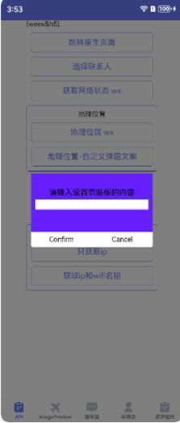

点击`confirm`，自动退出应用，重新进入后：


### 4.7.3 热更新配置指导

#### 4.7.3.1 离线包配置信息

* `url`：在`entry/src/main/ets/pages/ApiAndComponent.ets`中配置最新离线包配置获取的`url`，热更新模型会通过该地址获取离线包信息，来决定是否更新本地资源。
* 包名：与离线包下载后的位置相关，
* 初始版本：一般是`rawfile`资源的版本，比如，`rawfile`路径下的资源版本为`1`，最新版本为`2`，则需要热更新来更新资源

#### 4.7.3.2 热更新启动模块配置

导入包：`import { LocalUpdateManagerInstance, UpdateConfig, GlobalThis as Global } from ' WebRouterService'`。UpdateConfig的`setup`函数作用是初始化热更新模块，第一个参数为初始资源的版本号，该参数一般与`rawfile`下资源版本保持一致；第二个参数是一个`URL`生成器，该URL需要按照图中字段定义。 如果业务页面需要被点击才能进入，可以将热更新启动模块放在`aboutToAppear()`函数中，在页面被渲染前被加载，需要将参数`上下文`传递给启动模块`updateMiniOnLaunch()`。

setup函数参数说明：

| 名称 | 类型   | 描述                  | 是否必选 |
| ---- | ------ | --------------------- | -------- |
| initialVersion   | string | 初始资源版本号  | Y        |
| getUrlFunc | void | URL生成器 | Y        |


如果初始页面就是业务页面，可以将启动模块放在`EntryAbility.ets`的`onCreate()`函数中，在程序被启动时去加载热更新的启动模型。


#### 4.7.3.3 onInterceptRequest属性配置

热更新模块生效后，需要对资源进行拦截，使得最新资源能够生效，拦截请求在`web`组件的`onInterceptRequest`属性中进行配置。热更新提供`useSandboxCacheResource`函数判断是否需要自愿替换，该函数接收两个参数，`url`和`fakeDomain`,`url`为访问地址，`fakeDomain`为域名，返回`web`响应资源。

```ts
const localWebResourceResponse = LocalUpdateManagerInstance.useSandboxCacheResource(url, fakeDomain);
if (localWebResourceResponse != null) {
    return localWebResourceResponse;
}
```

当`localLastPath`不为空时，通过对`url`进行裁剪、拼接，访问本地对应位置的资源。

注意：本地离线资源的入口资源位置需要和`rawfile`的入口资源位置保持一致，如`rawfile`下的入口文件路径：`fakeDomain + 'resources/rawfile/frameworkTest_web/pages/index/entry.html'`。经过裁剪后的`path`为`'frameworkTest_web/pages/index/entry.html'`，本地离线资源的入口位置则是`localLastPath`下的`'frameworkTest_web/pages/index/entry.html'`。

```ts
useSandboxCacheResource(url: string, fakeDomain: string): WebResourceResponse | null {
  const localLastPath = this.localVersionInfo.path;
  if (fakeDomain && localLastPath != '') {
    let path: string | undefined = url?.replace(fakeDomain, '');
    path = path.replace(Constant.URL_HARD_RESOURCE, '');
    if (path && FileUtils.fileExist(localLastPath, path)) {
        return FileUtils.getFileOnResponseWeb(localLastPath, path);
     }
  }
  return null;
}

```

#### 4.7.3.4 立即生效机制用例：通过js注入

如果不在`JS`端配置相关函数，则会执行下次生效机制。

`Js`端调用热更新模块的方法，由于`js`端注册的监听函数是放入队列中等待特殊时机触发，所以需要在该时机到来前注册到队列中，不然无法生效。所以这里是放在生命周期函数中，页面被加载前执行。

`callNative`方法可以调用`arkts`端提前注入的方法，第一个参数是方法名称，第二个参数是需要传入的参数，第三个参数是需要执行的回调函数。本例中执行`onCheckForUpdate`方法，用作出现新的版本信息时进行相应的业务逻辑。该方法将执行的回调传递给`arkts`端，当该回调被触发时，会得到一个版本号，如果符合条件就结束；不符合的话就执行`arkts`端的`onUpdateReady`方法，依次类推，最终执行到`applyUpdate`方法。

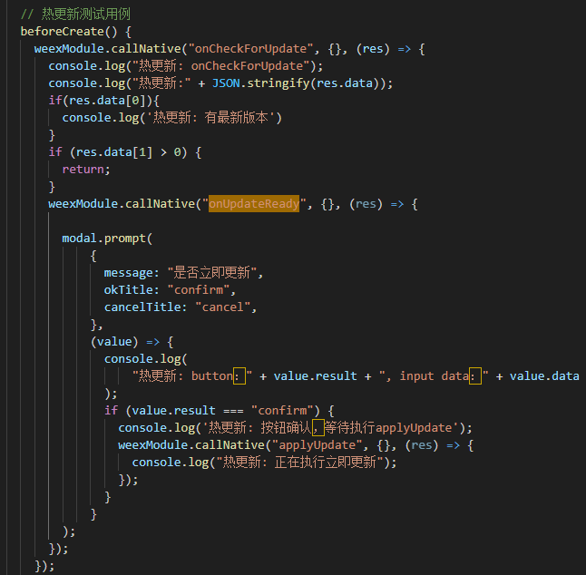

#### 4.7.3.5 服务端配置样例

`Bundle`服务管理通过解析云端配置信息，来获取最新离线资源的位置，进而下载。所以，为了确保`Bundle`服务能够正常运行，在初始化时配置的`url`，需要能够获取的配置信息如下所示。

当离线资源版本大于本地资源版本时，需要更新，获取的配置如下所示：

```json
{"code": 200, "message": "request OK", "data": {"download_url": "http://127.0.0.1/mpharmony/mpharmony.zip", "latest_version": 1}}
```

当前离线资源不需要更新时的配置可以参照如下所示：

```json
{"code": "300", "message": "latest version"}
```

### 4.7.4 热更新下次生效原理

#### 4.7.4.1 架构


1. 顶层

`UpdateManager`是`LocalUpdateManager`的基类，包含一些监听函数，可以为业务方提供一些逻辑注册机制，对数据变化进行监控。

`LocalUpdateManager`提供热更新的主要逻辑，包含两个私有属性和一个启动函数，`miniConfigRepository`包含关于热更新启动时获取离线资源包的机制，

`MiniRepository`包含对网络、本地离线以及`RawFile`等资源的管理和更新机制

2. 数据交互层

`miniConfigRepository`主要用作对离线资源配置的获取，包含一个私有属性和一个离线资源获取函数。

`MiniRepository`中有三个私有属性，`MiniNetworkDataSource`、`MiniLocalFileDataSource`以及`MiniRawFileDataSource`。

* `MiniNetworkDataSource`用于在离线配置获取后需要更新本地包时，进行下载最新离线资源等操作。
* `MiniLocalFileDataSource`用于本地离线资源包管理，如解压、离线包管理等
* `MiniRawFileDataSource`对`rawfile`资源进行配置

#### 4.7.4.2 逻辑实现

`LocalUpdateManagerInstance.updateMiniOnLaunch(this.context)`是热更新模块的入口程序。

`updateMiniOnLaunch()`执行逻辑:

1. 获取最新离线资源路径以及相应的版本号
2. 更新当前离线资源路径信息和版本信息，路径可以用作在`web`组件中的`onInterceptRequest`属性进行路径拼接，版本信息可传递给业务端进行逻辑处理
3. 离线资源配置获取：通过本地资源的版本号，来获取相应的配置
4. `notifyCheckForUpdate`触发`onCheckForUpdate`注册的监听函数，将版本信息传递给业务端，`onCheckForUpdate`可由业务端进行注册，
5. 版本更新判断：通过版本号的不同，路由到对应的配置资源，获取对应的配置
6. 资源下载：根据获取的配置，下载资源到临时目录中
7. 解压到固定位置
8. 触发相应的回调函数，如`notifyUpdateReady`触发`onUpdateReady`注册的监听函数，当热更新准备完成时，业务端可以进行相应的业务逻辑。
   
   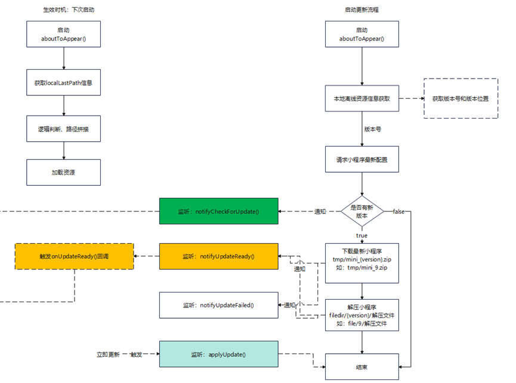

生效时机：热更新默认是下次启动更新，通过热更新模块，获取离线资源路径，在`web`组件的`onInterceptRequest`进行逻辑判断，如果本地离线资源路径可达，则加载本地离线资源。

### 4.7.5 热更新立即生效原理

#### 4.7.5.1 整体流程

业务端根据自身需要，通过`callNative`方法，可以调用`ArkTS`端注册的方法。业务端设计相应的热更新逻辑，如注册`onCheckForUpdate`的回调函数，获取本地离线资源的版本信息，该信息可用作是否进行立即更新操作的判断依据。在最新离线资源已经在本地准备好时，通过弹窗让用户选择是否立即生效。设计相应的逻辑后，通过`callNative('onUpdateReady', {}, (res)=>{})`方法调用`ArkTS`端提供的`CommonAdapter.run()`方法将逻辑注册到`ArkTS`端，等待`ArkTS`端触发回调。当`ArkTS`端通过`notifyUpdateReady()`方法触发了业务端注册的`onUpdateReady`的回调函数，会执行一段`js`方法`runCompleteCallback()`，获取到业务端注册的回调函数，在`js`端执行相应的操作。


进行热更新前还需要对离线资源的信息进行配置，如`url`、下载位置等，通过`fetchMiniConfig()`函数中去请求该地址的数据信息，通过返回的数据判断是否进行资源下载。

注册好需要的监听函数，通过启动模型启动热更新后，模块首先获取本地的最新资源配置，然后去请求最新离线资源配置信息，如需要更新则会在下载完成后通知业务端进行相应的操作；如果当前为最新配置，结束热更新操作。

#### 4.7.5.2 ArkTS端方法注册

在`arkts`端`CommonAdapter.ets`的`init()`函数中注册三个方法，通过`CommonAdapter.ets`中的`run`方法，可以通过对应的`map`对象找到对应的方法并进行适配，从而可以调用js端的回调函数完成相应的操作。`onCheckForUpdate`将包含执行js端方法的回调函数存入到本地数组中，等待触发时机(`notifyCheckForUpdate`)，并返回了本地离线资源版本信息给`js`端，`js`端可以通过该信息选择是否需要用户判断立即更新机制。`onUpdateReady`将包含执行`js`端方法的回调函数存入到本地数组中，当在某一特定时机(`notifyUpdateReady`)被触发，调用该回调，通知到`js`端。

```ts
import { LocalUpdateManagerInstance } from '../../bundleservice/update/LocalUpdateManager';
import { ResultStr, WeexProxyResult } from './apimodel/WeexResult';

export class UpdateApi {
  onCheckForUpdate(name: string, args: object, successCb: Function, failCb: Function, completeCb: Function) {
    const listener = (hasUpdate: boolean) => {
      completeCb(new WeexProxyResult(ResultStr.SUCCESS, [hasUpdate, LocalUpdateManagerInstance.gteLastVersion()]));
    }
    LocalUpdateManagerInstance.onCheckForUpdate(listener);
  }

  applyUpdate(name: string, args: object, successCb: Function, failCb: Function, completeCb: Function) {
    LocalUpdateManagerInstance.applyUpdate();
  }

  onUpdateReady(name: string, args: object, successCb: Function, failCb: Function, completeCb: Function) {
    const listener = (updatedPath: string) => {
      completeCb(new WeexProxyResult(ResultStr.SUCCESS, ''));
    }
    LocalUpdateManagerInstance.onUpdateReady(listener);
  }

  onUpdateFailed(name: string, args: object, successCb: Function, failCb: Function, completeCb: Function) {
    const listener = () => {
      completeCb(new WeexProxyResult(ResultStr.SUCCESS, ''));
    }
    LocalUpdateManagerInstance.onUpdateFailed(listener);
  }
}

```

`js`端可以通过`callNative('onUpdateReady', (res)=>{})`方式进行调用`arkts`端方法。

`CommonAdapter.ets`中的`run`方法是通过`registerJavaScriptProxy`注册方法注入到`js`端。`run`方法通过方法名来调用相应的函数接口。


**注意**：`js`端注册的监听函数需要在`arkts`端调用热更新模块前完成，这样在热更新模块调用相应的监听函数时`js`端才能被通知，否则`arkts`端已经执行完相应的功能但`js`端还未注册，这样就无法调用相应的回调去通知`js`端，即`js`端注册的功能失效。

#### 4.7.5.3 Js端方法注册

注册的方法要在热更新模块启动前注册好，这样当注册的方法被触发时才能生效。


在入口函数中，通过`vue`的生命周期函数`beforeCreate`，在页面被渲染前执行，调用了`vue`中自定义的`callNative`函数，传递了三个参数`name，params以callback`。实例中第一个`callNative`中的参数`name='onCheckForUpdate'，params={ }，callback =(res)=>{xxx}`。

`Vue`中的`callNative`内置了`weexModule.callNative`函数，该函数是通过`weex`导入了`arkts`注入到`js`端的对象。将参数传递给`js`对象后，相应的回调函数通过`id`进行映射，保存在一个`map`对象中，并将`id`通过`CommonAdapter`的`run`方法，封装成一个异步执行相应`js`代码的回调函数，传递到`arkts`端注册的键为`'onCheckForUpdate'`方法中。

回调执行：当封装的回调函数被执行，执行的`js`代码会执行到在`arkts`端注入的`js`代码，通过`id`取出之前存储到`map`对象里的回调函数进行执行，这样在`js`端定义的回调就被执行了。

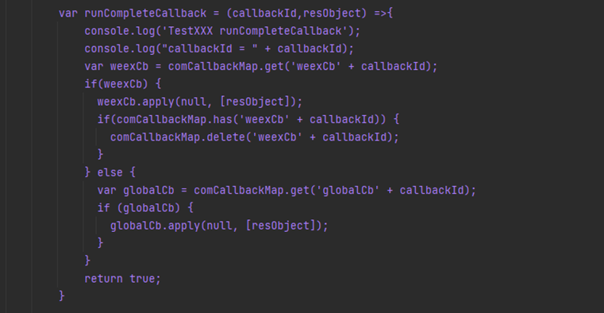

### 4.7.6 环境搭建

模拟服务器，server.js代码如下(根据实际情况，仅限参考)：

```ts
const express = require("express")
const cors = require("cors")
const bodyParser = require("body-parser")
const {access, readdirSync, statSync} = require("fs");
const morgan = require("morgan");
const _ = require("lodash")
const fileUpload = require("express-fileupload")
const os = require("os");

const app = express();

app.use(bodyParser.urlencoded({extended: false}));
app.use(bodyParser.json());
app.use(fileUpload({
    createParentPath: true
}))
app.use(cors())
app.use(bodyParser.urlencoded({extended: true}))
app.use(morgan("dev"))
app.use(express.static("uploads"))

app.listen(3000, function () {
    console.log('服务器已启动，监听端口3000。。。');
});


app.post('/upload', async (req, res) => {
    // console.log('req', req.files)
    try {
        if (!req.files) {
            res.send({
                status: false,
                message: 'No file upload'
            })
        } else {
            let avatar = req.files.file
            avatar.mv(`./upload/${avatar.name}`);
            res.end()
        }
    } catch (err) {
        res.status(500).send(err)
    }
})
app.get('/getIPAdress', function (req, res) {
    res.send(`http://${getIPAdress()}`)
    res.end()
})

app.get('/download', function (req, res) {
    var version = req.query.version;

    if (version === "last") {
        version = getLastVersion()
    }
    //检查文件是否存在
    const filePath = `./upload/${version}`
    access(filePath, function (err) {
        if (err) {
            res.send({code: 404, message: '文件不存在！'});
            return;
        }
        res.download(filePath, (err) => {
            if (err){
                console.log("下载中断: " + err)
                return
            }
            console.log("下载成功")
        })

    });
});

app.get('/apis/config', function (req, res) {
    let local_version = req.query.local_version;
    let lastVersion = getLastVersion()
    let version = splitOutLastVersion(lastVersion)
    if (local_version === "lowVersion") {
        local_version = "0"
    }else if (local_version === "last") {
        local_version = version
    }
    if (!(!isNaN(parseFloat(local_version)) && isFinite(local_version))){
        res.send({
            "code": 404, "message": "url错误",
        })
        res.end()
    }
    if (version === local_version) {
        res.send({"code": "300", "message": "latest version"})
    } else if (version > local_version) {
        res.send({
            "code": 200, "message": "request OK",
            "data": {
                "mini_download_url": `http://${getIPAdress()}:3000/download?version=${lastVersion}`,
                "mini_version": version,
                "effective_time": "now"
            }
        })
    }
    res.end()
});

function splitOutLastVersion(version) {
    return version.slice(version.indexOf("_") + 1, version.indexOf(".zip"))
}

function getLastVersion() {
    let dir = readdirSync("./upload")
    dir.sort((a, b) => {
        if (a > b) {
            return -1
        }
        return 1
    })
    for (const file of dir) {
        let stat = statSync(`${__dirname}\\upload\\${file}`)
        if (!stat.isFile()) {
            continue
        }
        return file
    }
    return ""
}

function getIPAdress() {
    let interfaces = os.networkInterfaces();
    for (let devName in interfaces) {
        let iface = interfaces[devName];
        for (let i = 0; i < iface.length; i++) {
            let alias = iface[i];
            if (alias.family === 'IPv4' && alias.address !== '127.0.0.1' && !alias.internal) {
                return alias.address;
            }
        }
    }
}
```

1.在server.js同级目录下创建upload目文件夹，用于存放资源文件

2.将离线资源按照命名规格命名:` bisName_version.zip`，如`min_1.zip`，放入`upload`文件夹下。

3.路由：根路径：`http://localhost:3000`。手机和电脑需要处于同一局域网下，由于用手机下载资源，需要用电脑本机的`IP`地址，所以需要先获取本机的`IP`信息，将`localhost`替换即可。最终`url`信息如：`http://192.xxx.xx.xxx:3000/apis/config?local_version=1`，替换到离线资源获取的`url`，该`url`处于`ets/update/data/source/bean/Constant.ets`的`url`变量中。

4.启动

`node ./server.js`

5.通过工程根目录下`test.html`，可以简单上传和下载，以及查看路由等。

注意：
1.Testserver 中返回字段与bundle服务保持一致，如下图

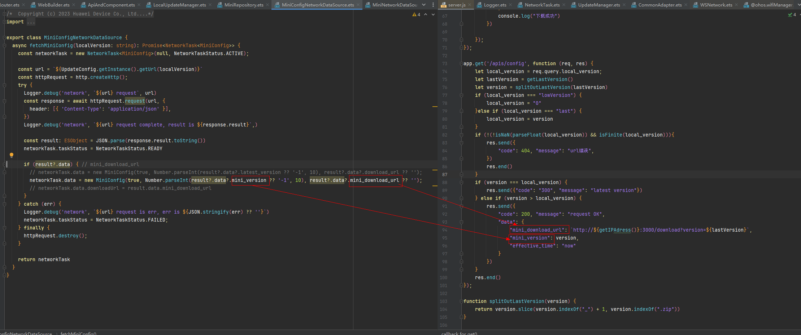

2.资源包文件解压后应该和resources/rawfile 文件结构保持一致，图例中，不能缺少frameworkTest_web文件夹

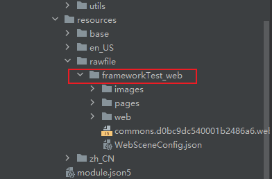


# 五、性能调优

## 5.1 jsb 异步

### 5.1.1 原理介绍

异步JSBridge调用适用于H5侧调用原生或C++侧注册的JSBridge函数场景下，将用户指定的JSBridge接口的调用抛出后，不等待执行结果， 以避免在ArkUI主线程负载重时JSBridge同步调用可能导致Web线程等待IPC时间过长，从而造成阻塞的问题。
this.controller.registerJavaScriptProxy(this.webAdapter,"webAdapter",["run"],["asyncRun"]); 第四个参数 asyncRun 提供了异步调用能力。

### 5.1.2 桥接思路

在weex-harmony模块中，callNative中isAsync参数表示是否使用异步，默认情况下走同步

```ts
let weexModule = {
  name: "weex扩展API",
  // 默认走同步
  // isAsync: 是否异步方式调用 native api
  callNative: function (name, paramObj, callback, isAsync = false) {
    // @ts-ignore
    native.run(name, paramObj, callback, isAsync);
  }
}
```

### 5.1.3 使用方法

```ts
const weexModule = weex.requireModule("weexModule");
weexModule.callNative('getNetworkInfo', params, this.callback, isAsync=True);
```

## 5.2 自定义协议的JavaScript生成字节码缓存

### 5.2.1 说明

适用于在页面加载时存在自定义协议的JavaScript文件，支持其生成字节码缓存到本地，在页面非首次加载时，节省编译时间。

### 5.2.2 接口和使用方法

提供了 `CodeCacheController` 接口，需实现其中的注册自定义协议方法 `getScheme` 和通过 url 获取文件内容的方法 `getResponseSettings`。

例如下面的例子，注册了一个名为 `scheme1` 的自定义协议，并将以此为开头的 url 进行拦截：

```typescript
import {
   codeCache,
   CodeCacheController,
   CodeCacheResponseSettings
} from 'WebSceneKitHsp';

class SchemeCodeCacheController implements CodeCacheController {
  getScheme(): webview.WebCustomScheme {
    return { schemeName: 'scheme1', isSupportCORS: true, isSupportFetch: true, isCodeCacheSupported: false };
  }

  getResponseSettings(url: string): CodeCacheResponseSettings | null {
    if (url.startsWith('scheme1://')) {
      let data: string | number | Resource | ArrayBuffer | undefined;
      data = getContext().resourceManager.getRawFileContentSync(`cache/${url.slice('scheme1://'.length)}`);
      if (data) {
        return {
          headerKey: 'ResponseDataId',
          // 格式：不超过13位的纯数字。JS识别码，JS有更新时必须更新该字段
          headerValue: '0000000000006',
          data: ParseUtil.bufferToString((data as Uint8Array).buffer)
        }
      }
    }
    return null;
  }
}

const schemeCodeCacheController = new SchemeCodeCacheController();
codeCache.registerController(schemeCodeCacheController);
```

### 5.2.3 注意事项

1. 自定义协议不得与Web内核内置协议相同；当使用 `file://` 或 `resource://` 等其他常见协议时，需在 `getResponseSettings` 函数中严格校验拦截范围，避免产生干扰。
2. 拦截自定义协议的JavaScript，设置的 `ResponseDataID` ，用于区分JS内容是否发生变更。若JS内容变更，`ResponseDataID` 必须一起变更。

## 5.3 预渲染

### 5.3.1 什么是预渲染

预渲染指在后台对需要加载的页面进行预先渲染，提前完成整个页面加载的流程。当用户需要访问该页面时，可以直接切换至前台展示，实现页面“秒开”的效果。预渲染要求在进行DOM解析、JavaScript执行和页面渲染之前，已经完成了所需资源的下载工作，否则可能会导致页面内容不完整或者渲染错误的情况。通过预渲染，可以显著减少用户等待页面加载的时间，特别是对于一些需要加载大量资源或者有复杂交互的页面。

### 5.3.2 预渲染原理

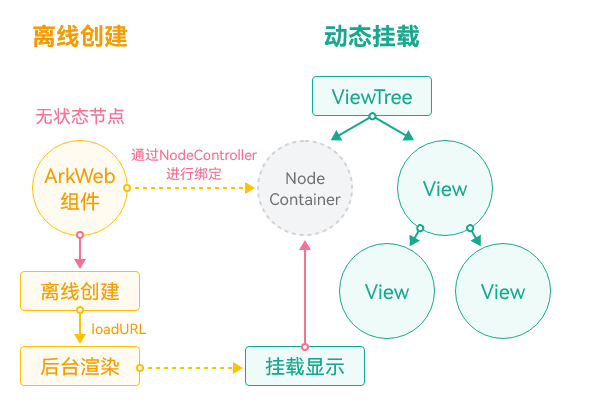

### 5.3.3 接口

ExtWebController.preRenderUrls(preRenderUrls: Array<string>) 接口

在进入目标页面之前，调用接口进行预渲染：

```javascript
ExtWebController.preRenderUrls([
      new PreRenderUrl('/data/storage/el2/base/haps/entry/files/web.html', true, false),
      new PreRenderUrl('resource://rawfile/frameworkTest_web/pages/index/entry.html?hello=world', false, false),
      new PreRenderUrl('https://www.jd.com/', true, false),
    ]);
```
提供PreRenderUrl接口，支持自定义销毁和刷新预渲染页面

| 名称 | 类型   | 描述                  | 是否必选 | 默认值 |
| ---- | ------ | --------------------- | -------- | ---- |
| url        | string | 预渲染页面路径  | Y        | |
| keepLive | boolean   | 预渲染实例是否保持存活不受页面回退影响 | Y    | |
| backFreeRender | boolean   | URL生成器      | N        | false |

### 5.3.4 预渲染效果

说明：首页为原生页。应用启动的时候预渲染了[华为商城主页](https://www.vmall.com/)。点击按钮“跳转到华为商城，有预渲染" 将跳转到新页面，新页面显示华为商城主页内容。
现象说明：

- 当在原生首页停留时间比较长，预渲染完全准备完毕时，跳转到华为商城主页秒开。
- 当在原生页面停留时间较短，预渲染可能还没结束，跳转到华为商城主页时有loading等待过程。
  

# 六、调试测试

## 1. 原生侧调试

原生侧调试请参考DevEco Studio 应用/服务调试： [https://developer.huawei.com/consumer/cn/doc/harmonyos-guides/ide-debug-app-0000001053702413](https://developer.huawei.com/consumer/cn/doc/harmonyos-guides/ide-debug-app-0000001053702413)

## 2. Web侧调试

web侧调试使用chrome的调试工具进行调试，可参考：[https://gitee.com/openharmony/docs/blob/master/zh-cn/application-dev/web/web-debugging-with-devtools.md](https://gitee.com/openharmony/docs/blob/master/zh-cn/application-dev/web/web-debugging-with-devtools.md)

# 七、三方库接入

按三方库文档正常使用。

# 八、FAQ

1、壳工程打开工程sync失败


解决方案：hvigor版本过低，根据提示一键升级同步或将hvigor-config.json5中的hvigorVersion和@ohos/hvigor-ohos-plugin配置信息修改为与DevEco Studio配套的信息，其中hvigorVersion为hvigor的版本号，@ohos/hvigor-ohos-plugin修改为本地hvigor地址

2、no ability has been launched


解决方案：

1）配置中选择entry模块


2）entry模块依赖webSencekitHsp，配置多hap包安装


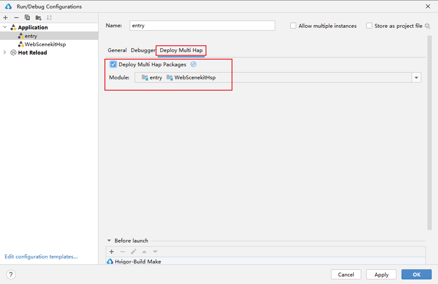

3、install sign info inconsistent 签名不一致

原因：手机上安装同名不同工程打出来的包

解决方案：手动卸载手机上的应用，重新打包安装


4、Invalid project path 项目路径无效

原因: 项目中包含中文路径,导致工程不能运行

解决方案: 去除项目中中文路径,使用英文路径命名


# 九、常见开发场景

### 1. **创建页面和组件**

#### 场景

开发一个简单的页面或组件来展示数据，比如列表、卡片等。

#### 解决方案

使用 Weex 的 `<template>` 和 `<script>` 标签定义组件。例如：

```vue
<template>
  <div class="container">
    <text class="title">{{ title }}</text>
  </div>
</template>

<script>
export default {
  data() {
    return {
      title: 'My Weex App',
    }
  }
}
</script>

<style scoped>
.container {
  padding: 20px;
}
.title {
  font-size: 30px;
}
</style>
```

### 2. **网络请求**

#### 场景

从服务器获取数据以动态加载内容。

#### 解决方案

使用 `weex` 提供的 `fetch` API。

```javascript
fetch('https://api.example.com/data')
  .then(response => response.json())
  .then(data => {
    this.items = data.items; // 更新数据
  })
  .catch(error => console.error(error));
```

### 3. **路由管理**

#### 场景

在多个页面之间导航，比如从主页跳转到详情页。

#### 解决方案

使用 Weex 提供的Navigator API

```javascript
navigator.push({
    url: 'resource://rawfile/pages/navigator_pop/entry.html',
    animated: "true"
  }, () => {
    console.log('跳转成功')
})
```

### 4. **自定义样式与主题**

#### 场景

根据不同需求定制应用的外观，比如暗色模式、品牌颜色等。

#### 解决方案

通过 CSS 或者 Weex 内置的样式来实现：

```css
.title {
  color: #3498db; /* 自定义颜色 */
}
```

### 5. **多屏适配**

#### 场景

根据不同设备屏幕需求适配页面元素大小。

#### 解决方案

weex项目编译成Web项目时，px单位都转成了rem相对单位，所以我们可以通过修改页面根元素html的font-size的值来跟随折叠屏的折叠/展开动作，在weex项目 **weex.init(Vue);** 之前加入下面代码：

```javascript
function setRootFont () {
    const doc = window.document
    const width = doc.documentElement.clientWidth
    const viewportWidth = 750
    const rem = width * 750 / viewportWidth / 10
    doc.documentElement.style.fontSize = rem + 'px'
}
window.addEventListener('resize', setRootFont)
```

在具体业务页面，为了避免折叠屏展开时部分图标、文字过大，可以使用wx单位。官方文档的说明如下：[CSS长度单位](https://weexapp.com/zh/docs/styles/css-units.html#css-%E9%95%BF%E5%BA%A6%E5%8D%95%E4%BD%8D)

# 十、规格说明

高阶API扩展包：AdvancedAPI_OHOS

鸿蒙化指导文档：docs

样例工程：example

测试用例：Test

web高阶API扩展包：web_api_ohos

鸿蒙化集成模块：web_scenekit_hsp

鸿蒙化拓展插件包：weex-openharmony

# 十一、附录

### [weex官方文档](https://weexapp.com/zh/docs/api/weex-variable.html)

### [bindingx使用方法](https://alibaba.github.io/bindingx/guide/cn_introduce)


